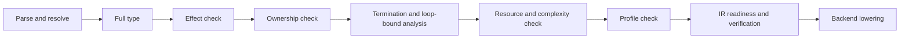
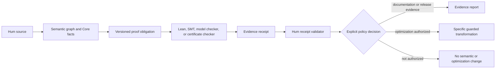

<!--
Research artifact imported on 2026-08-03.
Normalization: explicit UTF-8 decode, Deep Research UI citation markers stripped, typographic punctuation converted to ASCII, saved as UTF-8 without BOM.
Source names are preserved, but citation-only evidence cells may be blank; future runs should request direct source URLs in the Markdown body.
-->
# What OpenAI Astra's Ten Advances Should Teach the Hum Programming Language

## Executive verdict and audit basis

### Executive verdict

OpenAI's August 1, 2026 release is best understood as a **portfolio of mathematically substantial but computationally heterogeneous results**. It includes sharper asymptotic bounds, structural counterexamples, hardness reductions, explicit mathematical constructions, and impossibility results. It is not a portfolio of ten efficient executable algorithms, and the official announcement itself uses the more qualified formulation that the work "resolves or makes substantial progress" on ten problems.

The most important lesson for Hum is therefore not "add ten mathematical domains." It is that a strong algorithmic language must preserve and expose distinctions that ordinary programming environments routinely blur:

1. **Representation is algorithmic content.** Expression trees, shared DAGs, arithmetic circuits, formulas, straight-line programs, sparse matrices, packed bitsets, graph layouts, exact numbers, and floating approximations must not collapse prematurely into one generic representation.
2. **Complexity claims need typed models and evidence states.** A bound must identify its size measures, arithmetic model, worst-case or expected status, allocation behavior, precision dependence, and whether it is declared, structurally checked, proved, or measured.
3. **Certificates should be cheaper to verify than discoveries are to reproduce.** Hum should make proof and counterexample receipts first-class evidence artifacts while retaining authority over source semantics and optimization policy.
4. **Exact arithmetic and approximate arithmetic need visibly different contracts.** A theorem over mathematical integers, rationals, or real numbers cannot justify fixed-width or floating-point code without separate range, rounding, and approximation evidence.
5. **AI-assisted discovery needs provenance, failed-path retention, and independent reruns.** The valuable product is not merely a final proof; it is a structured trail separating conjectures, experiments, counterexamples, reductions, verified lemmas, attribution, and remaining uncertainty.

The highest-leverage near-term work for Hum is consequently:

- a normalized algorithm-complexity and evidence schema;
- explicit fixed-width arithmetic modes and packed-bit foundations;
- a small, layout-honest algorithm corpus;
- multiple graph storage types behind non-owning graph views;
- experimental exact-number packages;
- a proof-receipt boundary built on Hum's existing math-obligation architecture;
- one structured algorithm-research report format for human-AI work.

Hum should explicitly **not** put operator algebras, quantum games, sofic-group machinery, sphere-packing theory, lattice polytopes, or every Astra proof technique into the stable standard library. It should also not suggest that a lower bound produces a solver, that a Lean build establishes novelty, or that benchmark performance establishes asymptotic complexity.

### Audit record

| Audit item | Recorded value |
|---|---|
| Research date | August 3, 2026, America/New_York |
| OpenAI announcement | "Ten advances in mathematics and theoretical computer science," published August 1, 2026.  |
| Main manuscript | Official 249-page PDF, *Ten Advances in Mathematics and Theoretical Computer Science*. The retrieved edition exposes the August 1 publication date but no independent journal version or peer-review designation.  |
| Discovery narrative | Official 62-page *How the Ideas Came Together: Mathematical Discovery Notes*. Its introduction says it reconstructs connections, obstacles, changes of perspective, intermediate discoveries, and sustained detours from the model's reasoning and the papers.  |
| Lean repository | `openai/ten-proofs`, commit `94bc0feb6a9ff12c7d31d6de640a725c9d43d2b6`, committed August 2, 2026 |
| Formalization manifest | Version `v0.3`; reports zero `sorry` declarations and lists `propext`, `Classical.choice`, and `Quot.sound` as axioms; review status is `agent-reviewed`, not independently or peer reviewed.  |
| Lean toolchain | `leanprover/lean4:v4.32.0`.  |
| Hum repository | `hum-lang`, branch `main` |
| Hum audited commit | `3b2edb116253364efb0191ca6442f85276ae87d5`, committed August 3, 2026; it edits `WORKORDER_15.md`.  |
| Active Hum Work Order | Work Order 15, "Bind Canonical Minimal-Add Type Authority Per Operation"; status: corrected after first independent pre-issuance review, awaiting final independent review and possible activation; implementation remains unauthorized.  |
| Hum maturity | `0.0.1` pre-alpha; design seed with a Rust bootstrap front end and a narrow interpreted Formal Core subset. Cost and allocation sections are presently recorded intent and evidence surfaces rather than general proofs.  |

The investigation follows the supplied scope controls: Astra's ten advances are kept separate from First Proof submissions, earlier GPT-5 case studies, the unit-distance-conjecture work, benchmark results, novelty judgments, and the narrower claim that a Lean kernel accepted a formal artifact.

### Assumptions and confidence limits

The manuscript and certificate repository were released only two days before the research date. Targeted searches did not surface a direct, theorem-by-theorem independent replication, correction, or expert review of this exact ten-result package. Consequently:

- "Formally checked" below means the released repository manifest identifies a Lean declaration and reports a successful no-`sorry` formalization under its stated axioms.
- It does **not** mean this audit independently rebuilt every module, checked every dependency hash, reviewed every definition for theorem-statement fidelity, or established novelty across the complete literature.
- Novelty and prior-status conclusions are based primarily on the manuscript's literature review and theorem comparisons. They remain provisional pending field-specific review.
- "Constructive" is used narrowly. An explicit mathematical object or reduction may still be exponentially large, asymptotic, impractical, or dependent on hard subproblems.
- Hum recommendations are architecture proposals, not claims that the current compiler implements the syntax or behavior shown later.

### Key research questions and method

The investigation prioritized the following questions:

1. What exactly is proved or disproved in each result?
2. Which claims are bounds, reductions, constructions, structural theorems, or impossibility statements?
3. Which proofs expose executable algorithms, efficiently checkable certificates, hard instances, or only mathematical insight?
4. Which recurring discovery motifs can become APIs, compiler analyses, tests, proof workflows, or agent protocols?
5. What is the smallest set of numeric types, data structures, and algorithms that enables several domains at once?
6. How should Hum represent complexity, bit complexity, allocation, approximation, and callback costs?
7. How can Lean and other external verifiers provide evidence without becoming hidden compiler authority?
8. What bounded Work Orders can be added without interfering with Hum's active type-authority work or duplicating existing compiler stages?

The methodology was:

- reconstruct theorem statements from the official manuscript rather than the announcement summaries;
- compare each statement with the manuscript's account of prior bounds or conjectures;
- map each result to its listed Lean declaration and stated axioms;
- separate existence, constructiveness, efficiency, practicality, and API usefulness;
- inspect the current Hum architecture, compiler spine, evidence doctrine, and active Work Order;
- compare the proposed direction against C++, Rust, Julia, SageMath, Lean/mathlib, and Futhark;
- derive language and library recommendations only where at least two realistic workloads need the same foundation.

Hum's architecture already supports this conservative approach: Surface Hum lowers to Formal Core, then through explicit type, effect, ownership, resource, profile, and readiness gates; the project explicitly rejects turning report surfaces into stronger claims than they currently establish.

## Ten-result truth and computational-content audit

### Ten-result truth matrix

The ten advertised areas correspond to twelve listed top-level Lean declarations because the codes result has separate binary and spherical components, while the final extremal-graph result has separate compactness and two-degenerate counterexamples. The repository manifest supplies the declaration names shown below.

| Result | Exact theorem and identifier | Previous status | New contribution | Constructive and computational status | Formal and independent status | Hum relevance and confidence |
|---|---|---|---|---|---|---|
| High-dimensional sphere packing | The Cohn-Elkies linear-programming bound has exact exponential asymptotic \(LP_d^{1/d}\to\sqrt{e/(2\pi)}\), yielding density exponent about `0.6044`; the associated Fourier sign-uncertainty radii also have a sharp asymptotic. Lean: `PackingBounds.sharpFullCohnElkiesManuscriptConclusions`.  | The Cohn-Elkies method gave the leading general high-dimensional upper-bound framework, but its exact asymptotic strength was unknown. | Sharp characterization of that framework and a matching obstruction: the framework itself cannot improve the exponent further. | **New upper bound, matching lower bound within a proof framework, and impossibility ceiling.** Not an algorithm for constructing optimal packings. Some optimization subproblems may be numerically approximated, but the theorem is primarily asymptotic. | Manifest reports a no-`sorry` Lean declaration under the listed axioms. No direct independent review located by August 3. | Indirect relevance to optimization APIs, exact versus approximate geometry, and benchmark generation. **Medium confidence** on novelty until field review; high confidence that it is not a practical packing solver. |
| Binary and spherical codes | For every fixed binary relative distance \(0<\delta<1/2\), a new asymptotic upper bound strictly improves the optimized MRRW bound; for every spherical-code parameter \(0<s<1\), a hierarchy strictly improves the optimized Kabatiansky-Levenshtein bound. Lean: `MetricCodes.Johnson.binaryRate_lt_mrrw` and `MetricCodes.Spherical.HigherHierarchy.strict_hierarchy`.  | MRRW and Kabatiansky-Levenshtein had remained benchmark asymptotic upper bounds since the late 1970s. | Strictly stronger impossibility bounds on achievable asymptotic code rates or sizes. | **New upper bounds and proof techniques.** These do not construct better codes or decoders; they constrain what constructions can achieve. | Manifest reports two checked declarations. No direct independent review located. | Directly motivates packed bits, distance metrics, finite-field linear algebra, and property tests, but not a new stdlib encoder. **Medium confidence** on exact comparative novelty. |
| Non-sofic groups | An explicit finitely presented non-sofic group exists; the manuscript identifies the unit group of a binary Leavitt algebra and combines expander and centralizer obstructions. Lean: `SoficGroups.SourceTopLevelCompressionFinal.exists_finitelyPresented_nonsofic_group`.  | Whether every group is sofic had remained open; no explicit non-sofic group was known. | Counterexample to universal soficity, with an explicit finitely presented group. | **Explicit mathematical construction and structural impossibility result.** "Explicit" does not imply a practical general group algorithm; finite presentation and verification machinery are specialized. | Manifest reports a checked existence declaration. No independent validation located. | Useful as a stress test for symbolic algebra, rewriting, finite approximation, and certificate design. Near-term stdlib relevance is low. **Medium confidence.** |
| Connes's rigidity conjecture | There are infinitely many pairwise nonisomorphic finitely generated ICC property-(T) groups whose group von Neumann algebras are isomorphic; this disproves the rigidity conjecture and a finite-to-one expectation. Lean: `ConnesRigidity.exists_infinite_pairwise_nonisomorphic_propertyT_icc_groups_with_isomorphic_factors`.  | Connes conjectured that the group von Neumann algebra rigidly determines an ICC property-(T) group up to isomorphism. | Infinite family of counterexamples, reaching the manuscript's stated countability ceiling. | **Counterexample, structural theorem, and existence construction.** No near-term general executable operator-algebra algorithm follows. | Manifest reports a checked theorem. No independent field review located. | Relevant primarily to proof-assistant interoperability and specialist noncommutative-algebra experiments. **Low near-term Hum relevance; medium theorem confidence pending review.** |
| Arithmetic circuit complexity | For the symbolic permanent over \(\mathbb C\), the paper claims an \(\Omega(n^2\log\log n)\) lower bound for division-free arithmetic circuits with sharing and an \(\Omega(n^4/\log n)\) lower bound for formulas, including valid division. The manuscript explicitly distinguishes DAG circuits from tree formulas. The listed Lean declaration is `PermanentFormulaLowerBound.permanent_rational_formula_logarithmic_lower_bound`.  | Strong general lower bounds for unrestricted arithmetic computation are notoriously difficult; earlier bounds applied to narrower models or were weaker. | Stronger lower bounds in two carefully specified computation models. | **New lower bounds and impossibility results.** No faster permanent algorithm follows. The result is a direct warning against claims that compilers can always compress algebraic computations. | The manifest's named top-level declaration is formula-focused; this audit cannot infer from its name alone that it captures every headline circuit bound. Full theorem-to-certificate correspondence needs manual review. | Highest direct compiler relevance: tree/DAG distinctions, CSE, sharing, circuit metrics, and optimization non-promises. **High relevance; medium formal-correspondence confidence.** |
| Quantum parallel repetition | Every finite two-player, one-round entangled game with entangled value below one has uniform exponential decay under parallel repetition. Lean: `QuantumParallelRepetition.distributionUniformExponential`.  | The strongest prior general theorem described in the manuscript gave only polynomial decay; exponential decay was conjectured. | Universal exponential parallel-repetition theorem for the stated game model. | **New structural bound.** It is not a generic parallel-composition API and does not show that arbitrary dependent or entangled computations become independent. | Manifest reports a checked theorem; no independent review located. | General numeric foundations-complex matrices, tensors, SDP adapters-are reusable; the game-specific theory belongs in a specialist quantum package. **Low core relevance; medium confidence.** |
| Closest-vector problem | A deterministic polynomial-time many-one reduction from 3SAT to Euclidean `GapCVP` proves NP-hardness of approximation within \(n^{1/400}\); related bounds are claimed for binary nearest-codeword and fixed rational \(\ell_p\) norms. Lean: `GapCVP.Comparator.gapCVP400IsNPHard`.  | CVP approximation hardness was known under various reductions and assumptions, but the manuscript presents a direct reduction avoiding PCP and Projection Games machinery for this factor. | New direct reduction, hardness factor, and explicit hard-instance construction. | **Executable polynomial-time reduction, hard-instance generator, and hardness result.** It is emphatically not an efficient CVP solver. | Manifest reports a checked comparator theorem. No independent validation located. | Directly constrains lattice API promises and enables adversarial benchmarks. Security implementations additionally require constant-time engineering not supplied by the theorem. **High relevance; medium confidence.** |
| Ehrhart's volume conjecture | If a full-dimensional compact convex body \(K\subset\mathbb R^n\) has barycenter zero and no nonzero interior lattice point, then \(\mathrm{vol}(K)\le (n+1)^n/n!\), with equality attained by a centered simplex. Lean: `Ehrhart.Volume.ehrhart_volume_inequality_for_sets`.  | The conjecture was known in low dimensions, for simplices, and in special cases; weaker general bounds existed. | Sharp general volume inequality. The manuscript does not claim a complete equality-case classification. | **Sharp upper bound and structural theorem.** It does not itself provide a practical volume or lattice-point algorithm. | Manifest reports a checked declaration. No independent review located. | Supports the case for exact rational geometry and robust predicates in a specialist package, not core syntax. **Medium indirect relevance.** |
| Multicolor Ramsey numbers | There is an absolute \(c>0\) such that \(R_k(3)\ge (c\,k^{1/3}/\log k)^k\); together with the known factorial-type upper bound this gives \(R_k(3)=k^{\Theta(k)}\). Lean: `ErdosProblems.MulticolourTriangleRamsey.erdos_problem_183_explicit`.  | The prior lower bound cited in the manuscript was exponential with a constant base, far below the factorial-scale upper behavior. | Superexponential lower bound closing the growth-rate scale up to constants in the exponent. | **Probabilistic or explicit lower-bound construction and hard-instance source.** It does not make large Ramsey numbers computationally enumerable. | Manifest reports a checked explicit theorem. No independent review located. | Strong relevance to bitset graph kernels, reproducible randomized search, symmetry reduction, SAT integration, and certificate formats. **Medium-high relevance.** |
| Compactness and degeneracy in extremal graph theory | A finite family of connected bipartite cyclic graphs violates the Erdos-Simonovits compactness conjecture quantitatively; separately, a fixed connected bipartite two-degenerate graph has extremal number exceeding the conjectured \(n^{3/2}\)-scale behavior. Lean: `CompactnessConjecture.quantitativeCompactnessCounterexample` and `TwoDegenerateGraphs.twoDegenerateExtremalCounterexample`.  | Both conjectures proposed broad structural bounds on extremal numbers for graph families or two-degenerate bipartite graphs. | Quantitative counterexamples and explicit obstruction families. | **Counterexamples, constructions, hard instances, and structural impossibility results.** Degeneracy itself remains an efficiently computable graph primitive even though the theorem is extremal. | Manifest reports two checked declarations. No independent review located. | Direct motivation for degeneracy ordering, sparse layouts, graph certificates, and adversarial instance generators. **High practical relevance for graph libraries.** |

### Proof-status interpretation

The released certificate repository provides substantial evidence, but the evidentiary layers must remain separate:

| Question | What the released Lean artifact can establish | What remains separate |
|---|---|---|
| Does the formal declaration follow from encoded definitions and axioms? | Yes, subject to successful reproduction with the declared Lean and dependency environment. The manifest reports no `sorry` and the standard listed axioms.  | Rebuild reproducibility, dependency integrity, kernel trust, and inspection for `unsafe` or custom native extensions still require an independent audit. |
| Does the formal theorem exactly match the manuscript statement? | Only after definition-by-definition correspondence review. | Informal-to-formal semantic mismatch is possible even when Lean accepts the declaration. |
| Is the result novel? | No. | Requires a literature search and expert comparison with prior results. |
| Is the result important? | No. | Requires mathematical and domain judgment. |
| Does it yield efficient code? | No. | Requires extraction or reconstruction of an algorithm, then complexity and implementation analysis. |
| Are all assumptions acceptable for Hum? | No. | Hum must record arithmetic models, classical assumptions, profiles, and external trust classifications. |
| Can a proof enable an optimization? | Not automatically. | Hum policy must explicitly decide whether the receipt establishes the exact semantic and resource preconditions of the transformation. |

### Computational-content matrix

| Result | Executable algorithm | Construction | Reduction or hard instance | Certificate | Bound | Impossibility or disproof | Immediate library consequence |
|---|---:|---:|---:|---:|---:|---:|---|
| Sphere packing | No general solver | Auxiliary-function framework | Benchmark instances possible | Analytic proof certificate | Sharp asymptotic | Ceiling on Cohn-Elkies method | Numerical optimization and validated-transform experiments only |
| Binary and spherical codes | No encoder/decoder implied | Bound hierarchy | Adversarial parameter regimes | Rate-bound certificate | Stronger upper bounds | Limits attainable rate | Packed bits and code-validation foundations |
| Non-sofic group | Specialized symbolic construction | Yes | Stress instances for group packages | Presentation plus proof | Structural | Disproves universal soficity | Research example; defer general group package |
| Connes rigidity | No practical algorithm | Infinite counterexample family | Specialist operator-algebra witnesses | Formal theorem | Structural | Disproves rigidity and finite-to-one expectations | Proof interoperability only |
| Permanent lower bounds | No faster permanent algorithm | Hard polynomial family | Lower-bound witness model | Complexity proof | Circuit and formula lower bounds | Optimization ceiling | Preserve tree/DAG/circuit distinctions |
| Quantum repetition | No generic parallel API | Repeated game object | Adversarial entangled games | Inequality proof | Exponential decay | Rules out slow-decay behavior in model | Specialist quantum package |
| CVP | Yes: reduction, not solver | Lattice instances | Direct 3SAT reduction | Satisfying assignment or distance-gap evidence | Approximation hardness | Rules out promised efficient approximation unless P=NP | Hardness-aware lattice APIs and benchmarks |
| Ehrhart | No volume algorithm implied | Extremal simplex | Exact-geometry test cases | Inequality proof | Sharp volume bound | Limits possible volume | Exact rational geometry lab |
| Ramsey | Search kernels only | Lower-bound coloring family or distribution | Hard colorings | Coloring or no-monochromatic-triangle witness | Superexponential lower bound | Rules out smaller universal upper scale | Combinatorial search and bitset graph labs |
| Compactness and degeneracy | Degeneracy ordering is independently executable | Counterexample graphs | Hard extremal instances | Graph-property witness | Extremal lower/upper separations | Disproves two conjectures | Stable degeneracy primitive; specialist extremal search |

The central distinction is:

\[
\text{mathematical existence}
\ne
\text{constructive description}
\ne
\text{polynomial-time construction}
\ne
\text{practical implementation}
\ne
\text{stable general-purpose API}.
\]

## Discovery patterns and Hum architecture fit

The discovery notes emphasize that the final polished arguments omit much of the actual process: unsuccessful approaches, representation changes, intermediate discoveries, and long detours.  That observation supports a reusable workflow catalog, but only some motifs belong in executable libraries.

### Discovery-pattern catalog

| Motif | Mathematical use | Hum API or compiler use | Agent, testing, or proof use | Overgeneralization risk |
|---|---|---|---|
| Change the representation | Move from geometry to Fourier analysis, groups to finite approximations, formulas to circuits, or graphs to sparse orderings | APIs should make conversion explicit between tree, DAG, CSR, bitset, dense, sparse, exact, and approximate forms | Agents should record the old and new representation and why the change mattered | A universal "convert" abstraction can hide asymptotic cost, precision loss, or allocation |
| Preserve sharing | Distinguish formulas from circuits and repeated subexpressions from common nodes | IR should retain expression identity and DAG sharing; CSE should produce auditable provenance | Tests compare tree evaluation with DAG evaluation | Hash-consing everything can increase memory, destroy source locality, or be unsound with effects |
| Pass to a dual or relaxation | Linear-programming, spectral, Fourier, semidefinite, or probabilistic relaxations | First-party optimization APIs may expose `relax`, `dual`, and `certificate`, but only with typed gaps and assumptions | Agents can propose a relaxation and then search for integrality recovery or counterexamples | A relaxed optimum is not an exact solution; silent rounding can invalidate guarantees |
| Search for extremal obstructions | Counterexamples to conjectures, hard lattices, difficult colorings | Benchmark generators and adversarial test fixtures | `algorithm-report` should retain smallest known counterexamples and minimization history | Random failures are not universal lower bounds |
| Separate local and global structure | Local degree or neighborhood facts versus global expansion or rigidity | Graph views can expose local iterators while algorithms declare global preconditions | Model checking and fuzzing can target local invariants independently from global certificates | Local checks may be presented as a global proof |
| Symmetrize or average | Group actions, random colorings, Fourier or spectral reductions | Combinatorics and optimization packages may provide orbit iterators and deterministic group averaging | Agents can use symmetry to shrink search spaces and emit canonical representatives | Canonicalization can itself be expensive; averaging may erase integral or sparse structure |
| Use tensor products or repeated composition | Parallel repetition and coding constructions | Specialist tensor APIs; compiler may reason about shapes and work/span, not theorem-specific semantics | Differential tests compare sequential and repeated composition | Independence must not be inferred where entanglement, shared state, or correlated randomness exists |
| Reduce from a canonical hard problem | CVP hardness and hard-instance construction | Reduction objects can carry source/target instances and forward/backward witness maps | Generate adversarial benchmarks with reproducible provenance | A reduction proves hardness; it does not provide an efficient target solver |
| Extract a certificate rather than reproduce discovery | Verify code distance, graph coloring, linear-system solution, or proof receipt | APIs should return witnesses or checkable receipts where possible | Agents separate candidate generation from independent validation | A weak certificate may verify a different property from the advertised claim |
| Falsify with small cases | Counterexample search and conjecture triage | Combinatorial generators, bounded model checking, exhaustive bitset kernels | Preserve failed conjectures and minimal counterexamples | Passing small cases is not evidence of a universal theorem |
| Formalize after conceptual stabilization | Lean captures a stable statement and proof structure | Hum exports stable obligations rather than allowing a prover to infer source semantics | Proof adapters should pin theorem IDs, definitions, assumptions, and hashes | Premature formalization can harden the wrong statement; post-hoc formalization can miss discovery provenance |
| Distinguish lower bounds from algorithms | Circuit and lattice results constrain possibility | Diagnostics and documentation can warn when requested complexity promises conflict with known lower bounds | Agents should classify "solver," "reduction," "bound," and "counterexample" separately | Marketing language can turn impossibility evidence into an alleged capability |

### Result-by-result architectural disposition

| Result area | Core or stdlib? | Recommended home | Reusable contribution |
|---|---|---|---|
| Sphere packing | No | Numerical-optimization or coding research examples | Validated transforms, constrained optimization, high-dimensional benchmark generators |
| Binary and spherical codes | Foundations only | Specialist `hum-coding` after bitvectors, finite fields, and matrices mature | Packed Hamming distance, parity checks, code-distance certificates |
| Non-sofic groups | No | Community or long-term symbolic-algebra research package | Rewrite stress tests and finite-approximation representations |
| Connes rigidity | No | External Lean/Sage specialist work | Proof-receipt interoperability and noncommutative symbolic experiments |
| Arithmetic circuits | IR distinction belongs in compiler; complexity theory does not belong in syntax | Compiler IR plus experimental circuit package | Tree/DAG identity, CSE receipts, circuit size/depth metrics |
| Quantum repetition | General complex linear algebra only | Specialist quantum package | Tensor shapes, SDP adapters, exact metadata for repeated composition |
| CVP | Basic vectors and matrices only | Experimental lattice/coding package | Basis representations, approximation contracts, hard-instance provenance |
| Ehrhart | No geometric primitives in std | Exact-geometry/polytope specialist package | Rational predicates, determinants, lattice-point certificates |
| Ramsey numbers | Bitsets and graphs only | Combinatorics lab | Reproducible search, SAT adapters, symmetry reduction |
| Compactness and degeneracy | Degeneracy is general enough for a graph package | First-party graph lab, then stable graph algorithm if API matures | Linear-time ordering, sparse graph certificates, hard-instance corpus |

### Hum architecture fit matrix

Every recommendation below is assigned to exactly one architectural layer.

| Recommendation | Layer | Why this layer |
|---|---|---|
| Explicit checked, wrapping, and saturating fixed-width operations | **Core language** | Overflow semantics affect program meaning and optimizer legality |
| Canonical loop, recursion, arithmetic-mode, and place facts | **Core Hum** | Required for type, termination, resource, and backend preservation |
| Distinct tree, DAG, circuit, straight-line-program, and CFG identities | **IR/backend** | They are compiler representations, not ordinary source-level concepts |
| Bit operations, popcount, slices, sorting, selection, binary search, heap, deque, union-find, prefix sums, scans | **Stable stdlib** | Broad, representation-stable, and useful across domains |
| Non-owning graph views plus proven layouts after experimentation | **First-party lab** initially | Graph ownership and layout policy still needs corpus evidence |
| Big integers, rationals, modular arithmetic, finite fields | **First-party lab** | Foundational but profile-, allocation-, and backend-sensitive |
| Coding, lattice, polytope, circuit, quantum, and advanced optimization APIs | **Specialist package** | Narrow workloads and substantial domain-specific assumptions |
| `hum algorithm-report` and benchmark manifest tooling | **Tooling** | Cross-cuts source, tests, measurements, provenance, and agents |
| Proof receipt, complexity claim, benchmark run, and counterexample schemas | **Evidence schema** | Must remain verifier-neutral and machine-readable |
| Astra-specific theorem replications and adversarial instances | **Benchmark only** | Valuable as evidence without stabilizing theorem-specific APIs |
| General sofic-group, operator-algebra, or quantum-game syntax | **Reject** for core/std | No demonstrated general systems-programming demand |

This disposition aligns with Hum's existing architecture: the semantic graph is intended as shared structured truth for compiler tools and agents, and external systems are evidence producers rather than sources of hidden authority.

## Algorithmic-language scorecard and foundation plan

### Operational definition of an exceptional algorithmic language

Hum should claim exceptional algorithmic capability only when a public corpus demonstrates all of the following:

| Criterion | Measurable evidence |
|---|---|
| Pseudocode proximity | Independent reviewers can map a published algorithm to Hum source without hidden control flow or ownership behavior; source-token and cyclomatic overhead are measured |
| Static safety and failure | Invalid states, overflow modes, alias conflicts, and fallible calls are explicit; negative fixtures verify diagnostics and blame |
| Layout predictability | `size`, alignment, ownership, representation, and allocation reports are inspectable for every foundational container |
| Generic efficiency | Monomorphized or specialized code is inspectable; comparisons against concrete implementations show no unexplained abstraction cost |
| Numeric honesty | Exact, modular, fixed-width, floating, interval, and approximate domains are distinct; conversions record loss or proof obligations |
| Complexity contracts | APIs publish normalized time, space, allocation, bit-complexity, work/span, and approximation metadata with evidence status |
| Testing quality | Unit, property, fuzz, differential, model, regression, and adversarial testing are integrated into package evidence |
| Reproducibility | Seeds, toolchains, targets, dependencies, floating modes, and artifact digests are recorded |
| Optimization transparency | Generated code, transformation provenance, legality assumptions, and resource changes are inspectable |
| Proof interoperability | Obligations and receipts round-trip through Lean, SMT, and model-checking adapters without changing semantics silently |
| Diagnostics | Errors explain the violated law, shape, ownership fact, numeric domain, or complexity assumption |
| Interoperation | C ABI, Rust, C++, Python, Lean, solver, and scientific-system boundaries have explicit ownership and numeric mappings |

A "best" claim would require reproducible comparisons on a versioned corpus, not a feature checklist or aspiration.

### Comparative scorecard

The scorecard uses `0 = absent`, `1 = limited or external`, `2 = solid`, and `3 = leading`. It is a design audit, not a runtime benchmark. "Proposed Hum" is a target, not an implemented score.

| Ecosystem | Readable algorithm source | Layout and systems control | Exact numerics | General algorithm ecosystem | Complexity/resource contracts | Proof integration | Parallel model | Evidence and reproducibility | Total / 24 |
|---|---:|---:|---:|---:|---:|---:|---:|---:|---:|
| C++ with STL/Boost | 2 | 3 | 1 | 3 | 2 | 1 | 2 | 1 | 15 |
| Rust with crates | 2 | 3 | 1 | 2 | 1 | 1 | 2 | 2 | 14 |
| Julia | 3 | 1 | 3 | 3 | 1 | 1 | 2 | 2 | 16 |
| SageMath | 3 | 0 | 3 | 3 | 1 | 1 | 1 | 2 | 14 |
| Lean and mathlib | 1 | 1 | 3 | 2 | 2 | 3 | 0 | 3 | 15 |
| Futhark | 2 | 2 | 0 | 1 | 2 | 0 | 3 | 2 | 12 |
| Current Hum | 1 | 1 | 0 | 0 | 1 | 1 | 0 | 1 | 5 |
| Proposed evidence-complete Hum | 3 | 3 | 3 | 2 | 3 | 2 | 2 | 3 | 21 |

C++'s algorithms operate over generic ranges and include sequential and parallel execution-policy variants, but preconditions and complexity are largely library specification rather than machine-checked source contracts.  Rust exposes checked, wrapping, saturating, and overflowing integer operations and documents collection costs, providing a useful precedent for explicit arithmetic modes and practical complexity documentation.

Julia has built-in primitive, arbitrary-precision, rational, complex, and extensible promotion behavior, making it an important reference for expressive numerical programming; its default fixed-width integer overflow behavior also illustrates why Hum should make arithmetic intent more visible.  SageMath provides a broad exact-mathematics environment spanning integers, rationals, finite fields, graphs, and other research domains, but it does not target predictable low-level ownership and allocation in the way Hum intends to.

Lean/mathlib is the reference point for theorem-backed abstractions and an exceptionally broad formal library, including algebra, combinatorics, complexity, matrices, exact data structures, and proof automation. Its strength is proof rather than systems-oriented cost transparency.  Futhark adds the missing comparison dimension: a small language designed specifically for high-performance pure data-parallel array programming, with a deliberately small prelude and package ecosystem.

Current Hum scores low because it is pre-alpha and its implemented compiler spine is deliberately narrow. Its architecture and evidence model are promising, but unimplemented design intent must not be counted as capability.

### Numeric and algebraic foundation plan

| Candidate | Representation and semantics | Allocation and cost | Equality, ordering, and conversion | Recommended boundary |
|---|---|---|---|---|
| `I8`...`I128`, `U8`...`U128` | Fixed two's-complement or unsigned values; default ordinary arithmetic should be checked or profile-defined, never build-mode-dependent | Inline, no heap | Value equality; total integer ordering; narrowing is fallible | Core language and stable std |
| `Wrapping<T>` | Arithmetic modulo \(2^w\) | Inline | Equality and ordering over represented residues; conversions explicit | Stable std wrapper |
| `Saturating<T>` | Clamp at numeric bounds | Inline | Ordinary represented-value ordering | Stable std wrapper |
| `BigInt` | Sign plus normalized limbs | Heap except small-object optimization if later justified | Exact equality and ordering; fixed-width conversion returns range error | First-party numerics lab |
| `Nat` | Prefer `BigInt` plus nonnegative invariant initially, not a new built-in mathematical universe | Same as `BigInt` | Conversion checks nonnegativity | First-party lab |
| `Rational` | Canonical reduced numerator/positive denominator using `BigInt` | Heap and gcd-dependent | Exact equality; total ordering; float conversion returns rounding evidence | First-party numerics lab |
| `ModInt<M>` | Canonical residue with modulus in static or runtime type parameter | Inline when modulus fits; heap if backed by `BigInt` | Equality only for same modulus; no ordinary ordering by default | First-party numerics lab |
| `FiniteField` | Prime-field first; extension fields later with explicit irreducible polynomial | Depends on representation | Equality within same field identity; serialization includes field descriptor | Specialist algebra package |
| `BitVector<N>` | Inline packed words for static size | No heap | Bitwise equality and lexicographic ordering only when requested | Stable std after generics support |
| `BitSet` | Dynamic packed words | Heap; capacity and word count exposed | Set equality; iteration order deterministic | Stable std or first-party collections |
| `Float16/32/64` | IEEE-style binary floats with explicit strict or relaxed optimization profile | Inline | IEEE equality semantics; total-order helper separate | Core language |
| `Interval<T>` | Closed or decorated interval with outward rounding | Inline or small aggregate | Set equality distinct from overlap; conversions carry containment guarantees | Validated-numerics lab |
| `Complex<T>` | Pair of scalar components | Inline when scalar is inline | Equality componentwise; no ordering | First-party numerics, possibly stable later |
| Dense vector/matrix | Contiguous row-major default, explicit column-major alternative | Owned heap or borrowed view | Shape participates in validation; deterministic traversal | First-party linear algebra |
| Sparse vector/matrix | CSR/CSC/COO as distinct types, not a hidden runtime tag | Explicit arrays and allocation | Structural equality distinct from mathematical equality if duplicate entries exist | First-party sparse package |
| Polynomial | Dense coefficients or sparse terms as distinct types | Representation-dependent | Canonicalization policy explicit | Specialist algebra package |
| `Certificate<T>` | Opaque bytes plus typed metadata and verifier identity | Owned artifact | Equality by digest and schema, not semantic theorem equality | Evidence schema and proof bridge |

**Recommended syntax/type split.** Numeric domains should primarily be types, not ad hoc operator syntax. The source should make exceptional arithmetic visible through types or qualified operations:

```hum
let a: I64 = ...
let b = checked.add(a, c)      # fails explicitly
let c = Wrapping(a) + Wrapping(b)
let d: BigInt = bigint(a)
let q: Rational = rational(d, denominator)
let r: ModInt<65537> = modint(value)
```

Hum should resist implicit promotion from exact to approximate types. Conversions should be classified:

- **lossless:** `I32 -> I64`;
- **range-checked:** `BigInt -> I64`;
- **rounding:** `Rational -> Float64`;
- **modular:** `BigInt -> ModInt<M>`;
- **reinterpretation:** fixed-width bits to bitvector;
- **proof-requiring:** mathematical integer theorem instantiated with fixed-width code.

Silently treating these domains as interchangeable invalidates algorithms in concrete ways:

- An invariant proved over \(\mathbb Z\) can fail under fixed-width overflow.
- Gaussian elimination over a finite field uses multiplicative inverses modulo a prime, not integer or floating division.
- Reassociating `(a + b) + c` to `a + (b + c)` can change floating-point results, overflow behavior, and exception timing.
- A rational orientation predicate can be exact while a floating determinant returns the wrong sign near degeneracy.
- An \(O(n^3)\) algorithm over unit-cost field operations can have substantially different bit complexity when rational numerators and denominators grow.

### Algebraic-interface policy

Hum should begin with **small operational capabilities**, not a comprehensive category-theoretic hierarchy.

A plausible initial set is:

```text
Additive
Multiplicative
Zero
One
Comparable
ExactDiv
EuclideanDomain
FieldLike
Normed
```

These should exist only when they enable at least two real algorithms and can produce useful diagnostics. `Semiring`, `Ring`, `Field`, `Module`, and `VectorSpace` may become first-party interfaces later, but the compiler should not encode their mathematical laws as unquestioned facts merely because a type implements a trait.

Laws need three evidence levels:

| Law source | Meaning |
|---|---|
| Documented | Library author asserts the law; optimizer cannot rely on it |
| Tested | Property tests and finite-model checks support it for selected generators |
| Proved | A receipt ties the law to the exact implementation, type parameters, and version |

Static dispatch can erase call overhead, but it cannot erase code-size growth, compile-time cost, poor diagnostics, or semantic ambiguity. Generic arithmetic should therefore expose the operations an algorithm actually needs rather than requiring every matrix routine to quantify over a maximal algebraic hierarchy.

### Stable data-structure and algorithm foundation

The smallest useful stable algorithm layer before full high-level generics mature is:

| Priority | Foundation | Required contract |
|---|---|---|
| Immediate | slices, mutable slices, iterators, fixed arrays, dynamic arrays | Bounds, alias and mutation rules, capacity and allocation |
| Immediate | checked/wrapping/saturating arithmetic and bit operations | Exact overflow semantics and lowering |
| Immediate | sort, stable sort, partition, selection, binary search | Comparator law requirements, stability, worst-case or expected complexity, allocation |
| Immediate | heap/priority queue, deque, union-find | Amortized versus worst-case costs and invalidation rules |
| Immediate | bitvector and bitset operations | Word layout, endianness, tail-bit canonicalization, SIMD fallback |
| Near-term | prefix sums, scans, reductions | Associativity requirements, overflow mode, sequential versus parallel order |
| Near-term | deterministic pseudorandom generator interface | Algorithm/version identity and reproducible seed |
| Near-term | combinatorial iterators | Output-sensitive complexity and termination bounds |
| Experimental | graph views, BFS, DFS, topological sort, SCC, degeneracy | Layout-neutral read interface and result certificates |
| Experimental | shortest paths | Weight-domain and negative-cycle contracts |
| Experimental | exact elimination and modular arithmetic | Pivot policy, bit complexity, singularity certificate |
| Deferred | matching, flow, polynomial arithmetic, sparse kernels | Needs stronger generic, numeric, and layout foundations |
| Specialist | coding, lattice, polytope, quantum | Keep outside stable std |

Graphs should not have one universal owning type. Hum should develop:

- `AdjListGraph<V,E>` for mutable general graphs;
- `CsrGraph<V,E>` for compact static sparse graphs;
- `BitsetGraph<N>` for dense or small combinatorial kernels;
- `EdgeList<V,E>` for construction, sorting, and interop;
- `GraphView` and `MutableGraphView` for algorithms that do not own storage.

`degeneracy_order` is a strong candidate for the first stable graph algorithm after experimentation because it has a clear linear-time implementation over suitable adjacency access, produces a compact ordering and core-number certificate, and supports sparse search, coloring heuristics, clique algorithms, and extremal-graph workloads.

### First-party package roadmap

No more than six packages are justified in the near- to medium-term plan.

| Package | Purpose and users | Dependencies and representative API | Layout and complexity | Evidence and interop | Maturity, risk, Astra connection, recommendation |
|---|---|---|---|---|---|
| `hum-numerics` | Exact combinatorics, cryptographic prototypes, geometry, symbolic algorithms | `BigInt`, `Rational`, `ModInt`, checked conversions, gcd, modular inverse | Limb-based, explicit heap; contracts use bit lengths, not unit-cost arithmetic | Differential tests against GMP/Rust/Python; Lean translation for selected operations | **Lab -> alpha.** Risks: allocation surprises, timing leakage, canonicalization bugs. Enables nearly every relevant domain. **Adopt first.** |
| `hum-linear-algebra` | Numerical computing, codes, lattices, optimization | dense vectors/matrices, views, exact and floating elimination, basic sparse module | Separate dense/CSR/CSC types; shape and allocation contracts | BLAS/C ABI adapters, Python differential tests, exact reference kernels | **Lab.** Risks: numerical instability and premature abstraction. Astra connection: codes, CVP, quantum, Ehrhart. **Prototype second.** |
| `hum-graph` | Systems graph workloads, compilers, combinatorics, research search | graph views, adjacency/CSR/bitset layouts, BFS/DFS/SCC/topological sort/degeneracy | Layout-specific; complexity parameterized by vertices, edges, and word width | Differential tests against mature libraries; certificate checkers | **Lab -> potential stable subset.** Risks: universal-type temptation, hidden allocations. Astra connection: Ramsey and degeneracy. **Adopt.** |
| `hum-combinatorics` | Exhaustive search, generators, Ramsey kernels, circuit experiments | combinations, permutations, colorings, branch-and-bound scaffolds, optional circuit DAG | Packed and arena-backed search states | SAT/SMT adapters, reproducible seeds, counterexample receipts | **Experimental.** Risks: exponential APIs misrepresented as efficient. **Prototype after graph/bitsets.** |
| `hum-coding-lattice` | Error correction, storage research, post-quantum experimentation | code validation, parity matrices, lattice bases, LLL-style prototype, approximate CVP interface | Packed bits plus dense or integer matrices | Interop with established coding/lattice tools; constant-time mode explicitly out of scope initially | **Experimental specialist.** Risks: cryptographic misuse and false security claims. Astra connection: code bounds and CVP hardness. **Defer until foundations mature.** |
| `hum-proof-bridge` | Compiler, package, and research teams consuming external evidence | obligation export, receipt validation, Lean/SMT adapters, cache and staleness checks | Artifacts addressed by cryptographic digest | Lean, SMT-LIB, proof checker subprocesses; sandboxed checking | **Schema-first lab.** Risks: stale or mismatched theorem receipts. Astra connection: released Lean certificates. **Adopt schema work; defer deep integration.** |

No first-party quantum, operator-algebra, general group-theory, or polytope package should be committed to the medium-term roadmap. Polytope and Fourier experiments can initially live as examples on top of numerics and linear algebra.

## Compiler, complexity, proof, and AI workflow

### Compiler and IR requirements

Hum's future IR should preserve the following facts until the last pass that can safely discard them:

| Fact | Why preserve it |
|---|---|
| Exact arithmetic operation and overflow mode | Determines semantics and rewrite legality |
| Source expression tree identity | Needed for diagnostics and source-to-transformation correspondence |
| Shared expression DAG identity | Needed to distinguish duplicated computation from reuse |
| Straight-line program and circuit identity | Enables size, depth, scheduling, and CSE evidence |
| CFG and loop/recursion structure | Needed for termination, work, span, and resource analysis |
| Purity, effect, and replayability | Determines whether CSE, reordering, or recomputation is legal |
| Shape and dimension | Enables bounds checking and static specialization |
| Sparsity and layout | Enables CSR, bitset, and dense specializations without hidden conversions |
| Numeric precision and rounding mode | Prevents unsound floating rewrites |
| Symmetry or monotonicity claims | May justify specialist transformations only when proved or policy-approved |
| Allocation and ownership facts | Prevents hidden allocation and alias-invalid transformations |
| Complexity and benchmark identity | Keeps claims tied to the correct algorithm and configuration |
| Transformation provenance | Allows reviewers to inspect why an optimization ran |

The arithmetic-circuit result reinforces an important compiler non-promise: formulas and circuits are different computational models, and no general optimizer can be expected to discover an asymptotically optimal shared circuit for arbitrary algebraic source.

### Optimization classification

| Transformation | Classification | Required evidence |
|---|---|---|
| Dead-code elimination | Safe structural optimization | No effects or observable failure on removed path |
| CSE of identical pure exact expressions | Safe structural optimization | Purity, same arithmetic mode, same operands, no volatile state |
| Bounds-check elimination | Safe only with proof | Range fact tied to exact loop and container revision |
| Strength reduction for fixed-width integers | Requires arithmetic assumptions | Overflow equivalence and target semantics |
| Integer algebraic normalization | Requires algebraic law | Exact domain or proved range conditions |
| Floating reassociation | Requires numerical assumptions and profile permission | Explicit relaxed-FP profile; error and reproducibility impact |
| Loop fusion | Requires effect and resource analysis | Dependence proof, allocation change, cache and diagnostic impact |
| Sparse specialization | Requires layout fact | Sparse representation identity, duplicate-entry policy, shape |
| Bitset lowering of Boolean or graph kernels | Structural when semantics match | Tail-bit normalization, word width, endianness, SIMD fallback |
| SIMD Hamming distance | Profile and backend permission | Popcount availability, alignment, deterministic scalar fallback |
| Parallel reduction | Requires associativity and numerical policy | Proven/tested law, work/span contract, deterministic-tree option |
| Automatic differentiation | Specialist transformation | Differentiability domain, side effects, mutation and numeric model |
| Proof-guided bounds removal | Requires explicit receipt and policy | Current source/Core digest, theorem ID, checker identity |
| Algorithm replacement based only on benchmark | Benchmark-only decision | Versioned profile data; no semantic or asymptotic claim |
| Arbitrary formula-to-optimal-circuit conversion | Not suitable as a promise | Complexity lower bounds and undecidable or intractable search concerns |

Every optimization receipt should record:

```text
transformation_id
source_span
source_core_fact
input_ir_digest
output_ir_digest
semantic_preconditions
numeric_preconditions
resource_delta
proof_or_validation_method
target
profile
backend_preservation_result
diagnostic_explanation
```

### Normalized complexity and resource contracts

Big-O prose alone is insufficient. Hum should normalize algorithm claims into a schema resembling:

```yaml
complexity:
  parameters:
    vertices: graph.vertex_count
    edges: graph.edge_count
    word_bits: target.word_bits
  size_model: adjacency_entries
  arithmetic_model: fixed_width_unit_cost
  case: worst
  time:
    upper: vertices + edges
  space:
    auxiliary: vertices
  allocations:
    count_upper: 4
    bytes_upper: function_of(vertices)
  callbacks:
    neighbor_visit:
      calls_upper: 2 * edges
  parallel:
    work: vertices + edges
    span: unspecified
  evidence:
    status: proved
    receipt: sha256:...
```

The normalized model should support:

- worst-case, expected, amortized, and high-probability bounds;
- output-sensitive and input-sensitive measures;
- pseudo-polynomial and fixed-parameter complexity;
- approximation ratio and additive error;
- unit-cost versus bit complexity;
- oracle-call complexity;
- arithmetic-circuit size and depth;
- parallel work and span;
- memory, peak live bytes, allocation count, and scratch space;
- required numerical precision and error propagation.

**Callback composition** must be explicit. A generic traversal cannot claim `O(n)` total time if it calls a user callback `n` times without accounting for callback cost. The contract should form a symbolic cost such as:

\[
T(n)=T_{\text{traversal}}(n)+n\cdot T_{\text{callback}}.
\]

The same applies to termination: a loop over a callback-generated iterator needs both a structural bound on the iteration space and a termination contract for the callback.

### Stage-order compatibility

Hum's present compiler ordering places full type, effect, ownership, resource, and profile checks before IR readiness.  The proposed post-ownership termination and quantitative-loop-bound stage should remain a distinct producer:



The responsibilities should not overlap:

- ownership establishes places, moves, borrows, and mutation authority;
- termination establishes that recursion or iteration ends under stated assumptions;
- loop-bound analysis derives symbolic iteration bounds;
- resource analysis consumes those bounds to derive work, allocation, and memory obligations;
- profile checks decide whether the established or declared facts satisfy a deployment policy;
- benchmarks provide observations, never proofs.

### Proof and certificate boundary

Hum's existing math-engine doctrine already states the correct authority rule: Hum owns source semantics, graph facts, obligation identity, profile, and final evidence policy; external engines return receipts and cannot silently rewrite semantics or enable optimizations.

A concrete receipt schema should include:

```yaml
schema: hum.proof_receipt.v1
obligation_id: ...
source:
  file_digest: ...
  span: ...
  item_identity: ...
core:
  fact_id: ...
  core_digest: ...
claim:
  normalized_kind: ...
  statement_digest: ...
  assumptions:
    - ...
  arithmetic_model: ...
  target: ...
  profile: ...
verifier:
  family: lean
  version: 4.32.0
  dependency_lock_digest: ...
  theorem_declaration: ...
  checker_binary_digest: ...
artifact:
  proof_digest: ...
  build_manifest_digest: ...
trust:
  axioms:
    - propext
    - Classical.choice
    - Quot.sound
  unsafe_extensions: none_reported
  classification: externally_checked
result:
  status: proved
  checked_at: ...
staleness:
  key:
    - source.file_digest
    - core.core_digest
    - claim.statement_digest
    - verifier.version
    - verifier.dependency_lock_digest
    - claim.target
    - claim.profile
```

The import path should be:



For the Astra repository specifically, an independent audit should still:

- reproduce `lake build` from a clean environment;
- pin the exact mathlib commit and all transitive dependencies;
- inspect the project for `sorry`, `admit`, `axiom`, `unsafe`, native code, custom elaborators, and untrusted plugins;
- run each main theorem independently;
- compare each Lean definition with its manuscript counterpart;
- record checking time, peak memory, artifact size, and cache behavior;
- verify that comparator configurations test meaningful statement mutations;
- distinguish classical axioms from project-specific assumptions.

A successful Lean build may become release evidence. It should not silently alter code generation.

### AI-assisted algorithm-research workflow

At most two new tool directions are justified.

**`hum algorithm-report`** should produce a structured research artifact containing:

```text
question
known-results inventory
citations and attribution
candidate representations
conjectures
failed approaches
counterexamples
executable probes
lemmas and status
proof obligations
benchmark plans
independent reruns
human interventions
model interventions
novelty status
final claims and confidence
```

**`hum proof-obligations`** should be an evolution of the existing math-obligation surface rather than a separate theorem-prover command. It should export stable, source-linked obligations for external tools and ingest receipts through the ordinary evidence path.

The workflow should be:

1. Formalize the question and arithmetic/computational model.
2. Inventory prior results and attach stable citations.
3. Enumerate candidate representations and conversions.
4. Search tiny exact cases.
5. Retain failed approaches and minimized counterexamples.
6. State candidate lemmas as conjectures, not facts.
7. Build executable probes with deterministic seeds.
8. Export proof or model-checking obligations.
9. Validate with an independent tool or implementation.
10. Benchmark only constructive algorithms.
11. Record attribution and possible rediscovery.
12. Publish claim status separately as `conjectured`, `tested`, `proved`, `refuted`, `formally_checked`, `independently_reproduced`, or `peer_reviewed`.

Agents should query semantic graph and evidence records rather than scrape compiler prose, consistent with Hum's existing graph doctrine.

## Representative Hum design probes and benchmark corpus

The following sketches are deliberately future-facing. They identify required semantics; they are not claims that current Hum parses or executes this syntax.

A shared contract discipline is used throughout:

```hum
cost:
  model: ...
  time: ...
  space: ...
  allocations: ...
  evidence: declared | checked | proved | measured
tests:
  ...
benchmarks:
  ...
```

### Packed-bit Hamming distance

```hum
task hamming_distance(
  left: borrow BitSlice,
  right: borrow BitSlice
) -> Result UInt, LengthMismatch {
  needs:
    left.bit_length == right.bit_length

  ensures:
    result <= left.bit_length

  cost:
    model: fixed_width_unit_cost
    time: O(ceil(left.bit_length / target.word_bits))
    space: O(1)
    allocations: 0
    evidence: check

  does:
    if left.bit_length != right.bit_length {
      fail LengthMismatch
    }

    let distance: UInt = 0
    for index in 0 .. left.word_count
      bound: left.word_count
    {
      let difference = left.word(index) xor right.word(index)
      set distance = checked.add(distance, popcount(difference))
    }

    return distance
}
```

Missing features: **language**-bounded-loop facts and explicit arithmetic mode; **Core**-bit operations and source-preserved bounds; **stdlib**-`BitSlice` and `popcount`; **backend**-SIMD lowering receipt; **tooling**-scalar/SIMD differential benchmark. No proof-system feature is necessary for the base implementation.

### Linear-code validation

```hum
task validate_code(
  parity: borrow BitMatrix,
  codeword: borrow BitVector
) -> Result ValidCodeword, CodeShapeError {
  needs:
    parity.columns == codeword.length

  cost:
    model: word_ram
    time: O(parity.rows * ceil(parity.columns / target.word_bits))
    space: O(1)
    allocations: 0

  does:
    if parity.columns != codeword.length {
      fail CodeShapeError
    }

    for row in parity.rows_view()
      bound: parity.rows
    {
      if parity_dot(row, codeword) != Bit.zero {
        fail CodeShapeError.invalid_syndrome
      }
    }

    return ValidCodeword(codeword.digest)
}
```

Missing features: **stdlib**-packed matrix views; **package**-coding types and syndrome certificates; **tooling**-property generation from known generator/parity pairs; **proof system**-optional theorem that accepted codewords satisfy the encoded linear constraints.

### Graph degeneracy ordering

```hum
task degeneracy_order(
  graph: borrow GraphView
) -> Result DegeneracyCertificate, GraphError {
  cost:
    model: adjacency_entries
    time: O(graph.vertices + graph.edges)
    space: O(graph.vertices)
    allocations: bounded(4)

  does:
    let degrees = allocate UInt[graph.vertices]
    let buckets = DegreeBuckets.create(graph.vertices)
    let order = allocate Vertex[graph.vertices]

    initialize_degrees(graph, change degrees, change buckets)

    for position in 0 .. graph.vertices
      bound: graph.vertices
    {
      let vertex = buckets.remove_min()
        or fail GraphError.corrupt_view

      set order[position] = vertex

      for neighbor in graph.neighbors(vertex)
        bound: graph.degree(vertex)
      {
        if not buckets.removed(neighbor) {
          buckets.decrease(neighbor)
        }
      }
    }

    return DegeneracyCertificate {
      order: consume order
      maximum_forward_degree: verify_order(graph, order)
    }
}
```

Missing features: **language/Core**-nested derived bounds and place-safe mutation; **package**-graph views and degree buckets; **evidence schema**-certificate verifier; **tooling**-layout differential tests. This is the strongest candidate among the Astra-adjacent algorithms for eventual stabilization.

### Ramsey counterexample search kernel

```hum
task search_triangle_free_coloring(
  vertices: UInt,
  colors: UInt,
  seed: RandomSeed,
  budget: SearchBudget
) -> SearchResult ColoringCertificate {
  cost:
    model: bounded_search
    time: O(budget.nodes * ceil(vertices / target.word_bits))
    space: O(colors * vertices^2 / target.word_bits)
    allocations: bounded_by(vertices, colors)

  does:
    let state = ColoringState.create(vertices, colors)
    let rng = DeterministicRng.v1(seed)

    while state.has_branch() and budget.consume_node()
      decreases: budget.remaining_nodes
    {
      let edge = state.select_uncolored_edge(rng)
      state.branch_with_symmetry_breaking(edge)

      if state.forms_monochromatic_triangle() {
        state.backtrack()
      }
    }

    if state.complete() {
      return found state.certificate()
    }

    return exhausted budget.receipt()
}
```

Missing features: **language**-budget-backed termination; **package**-bitset graphs and combinatorial search; **tooling**-SAT differential adapter, seed and provenance recording; **proof**-independent coloring-certificate checker. The API must say `exhausted`, not "no coloring exists," unless search completeness is proved.

### Exact rational Gaussian elimination

```hum
task solve_exact(
  matrix: consume Matrix Rational,
  rhs: consume Vector Rational
) -> Result Vector Rational, LinearSolveError {
  needs:
    matrix.rows == matrix.columns
    matrix.rows == rhs.length

  cost:
    model: bit_complexity
    time: polynomial(matrix.rows, max_input_bit_length, coefficient_growth)
    space: O(matrix.rows^2 * peak_coefficient_bits)
    allocations: dynamic
    evidence: measured_and_proof_pending

  does:
    for pivot in 0 .. matrix.rows
      bound: matrix.rows
    {
      let selected = find_nonzero_pivot(matrix, pivot)
        or fail LinearSolveError.singular

      matrix.swap_rows(pivot, selected)
      rhs.swap(pivot, selected)

      normalize_row(change matrix, change rhs, pivot)
      eliminate_column(change matrix, change rhs, pivot)
    }

    return consume rhs
}
```

Missing features: **package**-`BigInt`, canonical `Rational`, matrices; **complexity schema**-operand-bit growth; **tooling**-differential tests against SageMath or another exact implementation; **proof**-optional certificate `A*x=b`. A simple `O(n^3)` unit-cost claim would be materially incomplete.

### Lattice closest-vector approximation skeleton

```hum
task approximate_cvp(
  basis: borrow IntegerMatrix,
  target: borrow IntegerVector,
  policy: ApproximationPolicy,
  budget: SearchBudget
) -> Result ApproximateLatticeVector, LatticeError {
  needs:
    basis.rows == target.length
    basis.has_full_column_rank

  cost:
    model: bit_complexity
    time: algorithm_dependent(policy, basis.shape, basis.max_bit_length, budget)
    space: algorithm_dependent(policy)
    allocations: dynamic

  does:
    let reduced = lll_reduce(basis, policy.reduction)
      or fail LatticeError.reduction_failed

    let candidate = nearest_plane(reduced, target)

    if policy.branch_and_bound {
      return bounded_refine(reduced, target, candidate, budget)
    }

    return ApproximateLatticeVector {
      vector: candidate
      guarantee: policy.claimed_guarantee
      evidence: not_proved
    }
}
```

Missing features: **package**-integer matrices, exact Gram-Schmidt alternatives, LLL and nearest-plane algorithms; **API policy**-guarantee must be attached to a proved implementation/version, not caller-selected prose; **security**-constant-time implementations require separate specialist work; **benchmarks**-hard instances from explicit reductions. The Astra result constrains promises rather than supplying this solver.

### Ryser permanent and arithmetic-circuit representation

```hum
type CircuitNode =
  | Input(row: UInt, column: UInt)
  | Constant(value: Rational)
  | Add(left: NodeId, right: NodeId)
  | Multiply(left: NodeId, right: NodeId)

type ArithmeticCircuit {
  nodes: Arena CircuitNode
  output: NodeId
}

task permanent_ryser(
  matrix: borrow Matrix Rational
) -> Result Rational, MatrixShapeError {
  needs:
    matrix.rows == matrix.columns

  cost:
    model: exact_arithmetic
    time: O(matrix.rows * 2^matrix.rows) ring_operations
    bit_complexity: derived_from(Rational)
    space: O(matrix.rows)
    allocations: bounded_by(matrix.rows)

  does:
    # Gray-code subset traversal; details omitted in this probe.
    return ryser_gray_code(matrix)
}
```

Missing features: **Core/IR**-stable node identities and DAG sharing; **package**-arena and circuit serialization; **complexity schema**-ring-operation and bit-complexity separation; **tooling**-compare tree expansion, shared DAG, and direct evaluator. The lower-bound theorem is a reason to preserve these distinctions, not to expose complexity-theory terminology in ordinary expressions.

### Lattice-point and polytope computation

```hum
task count_lattice_points(
  polytope: borrow RationalPolytope,
  box: IntegerBox,
  budget: EnumerationBudget
) -> Result BigInt, GeometryError {
  needs:
    box.provably_contains(polytope)
    polytope.dimension == box.dimension

  cost:
    model: output_and_box_sensitive
    time: O(box.integer_points * polytope.facets * exact_predicate_cost)
    space: O(polytope.dimension)
    allocations: bounded_by(polytope.dimension)

  does:
    let count = BigInt.zero

    for point in box.integer_points()
      bound: box.integer_points
    {
      if polytope.contains_exact(point) {
        set count = count + BigInt.one
      }
    }

    return count
}
```

Missing features: **package**-rational polytope, exact predicates, arbitrary-precision enumeration; **tooling**-differential comparison with established geometry software; **complexity contract**-explicit dimension and box-volume dependence. The Ehrhart theorem supplies extremal test fixtures, not an efficient counting algorithm.

### Fourier or spherical-code optimization kernel

```hum
task optimize_spherical_bound(
  dimension: UInt,
  degree: UInt,
  precision: PrecisionBits,
  budget: SolverBudget
) -> Result CertifiedBound, OptimizationError {
  cost:
    model: precision_aware
    time: solver_dependent(dimension, degree, precision, budget)
    space: solver_dependent
    allocations: dynamic

  does:
    let program = build_semidefinite_relaxation(dimension, degree)
    let approximate = sdp.solve(program, precision, budget)
      or fail OptimizationError.no_solution

    let interval_bound = validate_with_intervals(program, approximate)
      or fail OptimizationError.uncertified

    return CertifiedBound {
      upper: interval_bound.upper
      precision: precision
      solver_receipt: approximate.receipt
      validation_receipt: interval_bound.receipt
    }
}
```

Missing features: **packages**-polynomials, intervals, linear algebra, solver adapter; **proof boundary**-independent validation of approximate solver output; **complexity**-precision and solver model. The API visibly separates approximate discovery from certified validation.

### Proof-certificate adapter

```hum
task check_external_receipt(
  obligation: borrow ProofObligation,
  receipt: borrow ProofReceipt,
  policy: borrow EvidencePolicy
) -> Result AcceptedEvidence, ReceiptError {
  needs:
    obligation.id == receipt.obligation_id

  cost:
    model: artifact_size
    time: O(receipt.bytes + verifier_check_time)
    space: verifier_reported_peak
    allocations: isolated_process

  does:
    verify_digest_matches(obligation, receipt)
      or fail ReceiptError.stale

    verify_toolchain_allowed(receipt, policy)
      or fail ReceiptError.untrusted_toolchain

    let check = sandbox.run_checker(receipt)
      or fail ReceiptError.check_failed

    if not check.matches_claim(obligation) {
      fail ReceiptError.statement_mismatch
    }

    return AcceptedEvidence {
      obligation_id: obligation.id
      receipt_digest: receipt.digest
      trust: policy.classify(check)
    }
}
```

Missing features: **evidence schema**-obligation and receipt identities; **tooling**-sandboxed checker execution and cache keys; **profile policy**-accepted axioms and verifier families; **compiler rule**-no automatic semantic effect.

### Algorithmic benchmark and validation corpus

The corpus should be versioned independently from the language implementation so that compiler changes, library changes, and benchmark changes can be distinguished.

| Theme | Tiny exact fixtures | Random/property tests | Adversarial and differential cases | Measurements |
|---|---|---|---|---|
| Bitset Hamming | Hand-counted words and tail bits | Random bitvectors versus scalar reference | Misaligned slices, all-zero/all-one, non-word-aligned lengths | Throughput, branches, SIMD use, allocations |
| Finite-field elimination | Small matrices with known rank | Generate `A`, `x`, test `A*x` | Singular, nearly structured, modulus mismatch | Operations, memory, field representation |
| Graph degeneracy | Paths, cliques, cycles | Random sparse graphs | High-degree skew, duplicate edges, disconnected graphs | Time by `V+E`, allocations, cache behavior |
| Shortest paths | Tiny weighted graphs | Random graphs with verified reference | Negative cycles, overflow-scale weights, disconnected nodes | Time, heap operations, memory |
| Union-find | Known partitions | Random operation traces | Long chains, repeated unions, rollback variants | Amortized distribution, allocation |
| Permanent | `n<=8` exact enumeration | Random small integer matrices | Dense/sparse, repeated rows, zero-heavy | Ring ops, bit growth, DAG size |
| Ramsey search | Known small colorings | Random seeded search | Symmetry-heavy and near-complete hard states | Nodes, backtracks, certificate-check time |
| Lattice reduction/CVP | Low-dimensional hand instances | Random unimodular transforms | Skew bases and reduction hard cases | Bit growth, approximation ratio, memory |
| Polynomial multiplication | Small exact products | Random coefficients | Sparse/dense crossover, huge coefficients | Work, allocations, bit complexity |
| Sparse matrix-vector | Tiny CSR/CSC | Random sparsity patterns | Empty rows, power-law degrees, duplicate entries | Bandwidth, cache misses, allocation |
| Polytope predicates | Simplex and cube | Random rational halfspaces | Near-boundary and huge-denominator points | Predicate time, coefficient growth |
| FFT/transform | Known impulses and sinusoids | Random round-trip tests | Prime lengths, large dynamic range | Error, time, scratch allocation |
| Coding | Repetition and Hamming codes | Generated codewords and errors | Boundary-distance errors, malformed matrices | Decode success, time, timing variance |
| Certificate checking | Small valid/invalid receipts | Mutation of every receipt field | Stale source, wrong theorem, wrong axioms | Check time, peak memory, cache behavior |

Every benchmark record should contain:

```yaml
benchmark_id: ...
semantic_oracle: ...
input_generator:
  version: ...
  seed: ...
source_digest: ...
dependency_digest: ...
compiler:
  version: ...
  flags: ...
target: ...
profile: ...
time_distribution:
  samples: ...
  median: ...
  tail: ...
memory:
  peak_bytes: ...
  allocation_count: ...
output_validation: ...
numeric_tolerance:
  model: exact | absolute | relative | interval
evidence_kind: proof | measurement | observation
```

Benchmark wins must never be promoted to asymptotic claims. Conversely, an asymptotically better algorithm should not be advertised as practically faster without measurements in the relevant range.

## Prioritized roadmap, risks, decisions, and gaps

### Risk register

| Risk | Failure mode | Control |
|---|---|---|
| Theorem hype becomes language scope | Ten specialist areas produce ten unstable built-ins | Require two independent workloads and a stable representation before std admission |
| Nonconstructive proof presented as algorithm | Existence theorem marketed as executable capability | Mandatory computational-content classification |
| Lower bound presented as solver | CVP or permanent hardness confused with an implementation advance | API and documentation labels: `reduction`, `hardness`, `bound`, `solver` |
| Trait overengineering | Large algebra hierarchy causes poor diagnostics and compile-time cost | Begin with operational capabilities; add laws only with corpus evidence |
| Numeric unsoundness | Integer, modular, rational, and floating semantics silently mix | Explicit types and fallible or rounding conversions |
| Hidden allocation | Exact arithmetic or graph abstraction allocates unexpectedly | Allocation contracts and layout reports |
| Misleading complexity | Unit-cost `O(n^3)` hides operand growth or callback cost | Normalized bit-complexity and callback transformers |
| Proof receipt staleness | Old certificate accepted after source or dependency changes | Complete stale-evidence key and digest validation |
| Lean theorem mismatch | Checked declaration formalizes weaker or different statement | Manual definition correspondence review and mutation tests |
| External verifier becomes compiler authority | Proof success silently enables behavior | Explicit evidence-policy gate before optimization |
| Unattributed rediscovery | Agent presents known argument as novel | Citation inventory and novelty status required in algorithm reports |
| Cryptographic misuse | Experimental lattice or coding API used for security | Prominent non-security status; constant-time and side-channel review as separate maturity gate |
| Specialized packages bloat std | Quantum, polytope, and group APIs become permanent core burden | Specialist-package and community layers |
| Benchmarks presented as proofs | Fast test used to claim complexity or correctness | Evidence kind must be `measurement`, not `proof` |
| Floating rewrites break reproducibility | Reassociation changes results or exceptions | Strict default; relaxed profile opt-in with receipt |
| One universal graph type | Every workload pays for runtime tags or conversions | Multiple owning layouts plus non-owning views |
| Active Work Order interference | Broad algorithm work destabilizes narrow type-authority work | No implementation work touching Work Order 15's files until its authorization cycle closes |

### Prioritized implementation sequence

The sequence deliberately starts with documentation, schemas, and fixtures that can be reviewed independently of Work Order 15. File envelopes are bounded proposals against the audited repository layout.

| Increment | Exact goal and likely file envelope | Dependencies and non-goals | Fixtures and evidence | Rollback and completion criterion |
|---|---|---|---|---|
| Algorithm evidence vocabulary | Define `hum.algorithm_claim.v0` and distinguish algorithm, reduction, bound, construction, certificate, conjecture, test, and benchmark. Files: `docs/ALGORITHM_CLAIM_SCHEMA.md`, `schemas/hum.algorithm_claim.v0.json`, `fixtures/algorithm_claim/*`, architecture index updates only. | No parser, compiler, or syntax changes. | Valid and invalid status transitions; stale citation and missing model fixtures. | Pure documentation/schema rollback. Complete when schema validation and cross-document links are green. |
| Complexity model | Define normalized size measures, cases, arithmetic models, bit complexity, callbacks, work/span, approximation, allocation, and evidence state. Files: `docs/COMPLEXITY_MODEL.md`, `docs/RESOURCE_REPORT_SCHEMA.md`, schema fixtures. | Depends on claim vocabulary. Does not claim compile-time verification. | BFS, sort, exact elimination, Ramsey search, and callback examples. | Revert schema version before any source adoption. Complete when every example has one unambiguous interpretation. |
| Arithmetic semantics decision | Specify fixed checked, wrapping, and saturating arithmetic and conversion classes. Files: new decision record, `SPEC.md`, `docs/FORMAL_CORE.md`, numeric fixtures; no implementation until separately authorized. | Must not interfere with Work Order 15's narrow `Int + Int` authority. No `BigInt` implementation. | Overflow truth tables, conversion failures, constant-folding expectations. | Decision can remain proposed. Complete when source, Core, backend, and diagnostics semantics agree. |
| Packed-bit lab | Prototype `BitVector`, `BitSlice`, popcount, Hamming distance, and property tests outside stable std. Files: `experiments/algorithms/bitset`, `examples/probes`, benchmark manifests. | Needs arithmetic semantics and array ownership facts. No SIMD promise. | Scalar oracle, tail-bit cases, random differential tests, allocation reports. | Delete experimental module without language impact. Complete when scalar semantics and benchmark records are reproducible. |
| Graph-view and degeneracy lab | Implement adjacency-list, CSR, and bitset graph probes behind read-only views; add degeneracy certificate checker. Files: `experiments/algorithms/graph`, fixtures, benchmark corpus. | Depends on slices, packed bits, and complexity schema. No universal graph type or stable API. | Cross-layout identical results, malformed views, adversarial sparse graphs. | Experimental isolation. Complete when all layouts produce the same certified ordering. |
| Exact numerics prototype | Build `BigInt`/`Rational` API prototype through an external proven library or Rust crate adapter before native backend work. Files: first-party lab package, FFI/interop docs, exact-elimination probes. | No std stabilization; no constant-time claim. | Differential arithmetic, canonicalization, overflow conversions, coefficient-growth measurements. | Adapter can be removed or replaced behind package boundary. Complete when semantics and bit-complexity telemetry are stable. |
| Proof-receipt validator | Extend current math-obligation architecture with verifier-neutral receipt validation and Lean fixture import. Files: `docs/MATH_OBLIGATIONS_SCHEMA.md`, new receipt schema, `src` validator module only after schema acceptance, receipt fixtures. | No embedded theorem prover; no optimization activation. | `proved`, `refuted`, `unknown`, `unsupported`, `timeout`, stale, mismatch, untrusted-axiom fixtures. | Receipt ingestion can be disabled without changing program semantics. Complete when every status remains distinct and reproducible. |
| Algorithm-report tool | Generate a local machine-readable research dossier from source, graph facts, tests, benchmarks, and receipts. Files: CLI subcommand, schema, fixture notebooks. | Depends on claim, complexity, benchmark, and receipt schemas. No novelty oracle. | Failed approach, counterexample, attributed rediscovery, independent rerun cases. | Tool is additive and removable. Complete when reports can be regenerated byte-for-byte under fixed inputs. |
| Stable-algorithm admission | Promote only bit operations and selected general algorithms after corpus evidence. Files: eventual std modules, API docs, conformance tests. | Requires generics, ownership, allocation, and backend evidence. No graph or exact-number stabilization by default. | Cross-target, no-heap profile where applicable, negative diagnostics, generated-code inspection. | Each algorithm admitted separately. Complete per algorithm, not as one bulk merge. |

Work Order 15 is currently a narrow, explicitly gated effort to establish canonical `Int + Int` type authority. It states that it is not general addition typing, operator overloading, complete typed Core, IR, optimization, or backend work. Future algorithm Work Orders should preserve that boundary and avoid editing its listed production path until the independent authorization process concludes.

### Draft design decisions

**Exact arithmetic foundations**

Hum will distinguish fixed-width checked arithmetic, wrapping arithmetic, saturating arithmetic, arbitrary-precision integers, rationals, modular integers, finite fields, and floating approximation as separate semantic domains. Stable core syntax will cover fixed-width modes; arbitrary-precision and algebraic domains will begin in first-party labs. No proof over mathematical integers authorizes fixed-width code without range evidence.

**Algorithm complexity metadata**

Algorithm contracts will identify parameters, size measures, arithmetic model, case, time, space, allocation, precision, callback composition, and evidence status. Declared complexity is not automatically proved. Benchmarks remain measurements. Post-ownership termination and loop-bound analysis will produce facts consumed by resource analysis rather than duplicated there.

**Graph representation policy**

Hum will not define one universal owning graph. Algorithms will initially consume non-owning graph views, with separate adjacency-list, CSR, bitset, and edge-list storage types. Layout conversion costs must be explicit. Degeneracy ordering is the first Astra-adjacent graph primitive to target for stabilization after first-party experimentation.

**External proof-certificate interoperability**

External provers are evidence producers. A receipt must bind the obligation, source span, Core fact, assumptions, arithmetic model, target, profile, verifier and dependency versions, theorem identifier, artifact digest, axioms, result, and stale-evidence key. Receipt acceptance does not change semantics or enable optimization without a separate explicit policy decision.

**First-party algorithm labs**

Hum will grow a small set of foundational labs-numerics, linear algebra, graph algorithms, combinatorics, coding/lattices, and proof bridging-rather than mirroring Astra's ten topics. Promotion to stable std requires broad demand, representation stability, diagnostics, allocation and complexity evidence, cross-target testing, and a rollback-safe migration plan.

### Direct answers to adversarial design questions

| Question | Decision |
|---|---|
| Which Astra results have no useful near-term Hum implication? | Connes rigidity and non-sofic groups have no near-term core or stdlib implication. Quantum repetition affects only general numerical foundations and a possible specialist package. |
| Which apparent algorithms are nonconstructive or non-practical? | Sphere-packing, code, Ehrhart, and quantum results are principally bounds or structural theorems. Connes is an infinite counterexample construction, not a practical operator-algebra algorithm. |
| Which results produce computationally useful reductions or instances? | CVP directly provides a polynomial-time reduction and hard instances. Ramsey and extremal-graph results motivate hard combinatorial fixtures. |
| Which APIs require arbitrary precision? | Exact rational elimination, large determinants, lattice and polytope predicates, many modular and coding proofs, exact permanent computation, and certificate normalization. |
| Which require constant-time engineering? | Security-facing lattice, finite-field, coding, and post-quantum implementations. Mathematical correctness is insufficient for timing security. |
| Static or dynamic dimensions? | Small SIMD vectors and fixed bitvectors benefit from static dimensions; graphs, general matrices, lattices, and research instances usually require dynamic dimensions. Views should permit both. |
| Should algebraic traits be broad? | No. Begin with bounded operational interfaces and add mathematical hierarchies only when multiple algorithms and good diagnostics justify them. |
| Where should arbitrary-precision integers live? | First-party package initially, possibly profile-dependent stable library later; not core syntax in the near term. |
| One graph type? | No. Multiple layouts with shared views. |
| How should bit complexity be stated? | In terms of operand bit lengths, coefficient growth, multiplication/division cost functions, and output size-not one unit per arithmetic operation. |
| How do callbacks affect contracts? | Publish call-count bounds and symbolic callback cost/termination obligations. |
| Can floating algebraic rewrites be automatic? | Only identities valid under the active floating semantics. Reassociation and distributivity require relaxed-profile permission and numerical evidence. |
| How can receipts enable optimization without becoming authority? | The receipt establishes a fact; an explicit Hum policy maps that fact to one named transformation under one target/profile. |
| How should Hum distinguish theorem from tested conjecture? | Distinct machine-readable statuses with monotonic transition rules and attached evidence. |
| How should agents handle attribution? | Every claim carries citations, prior-work inventory, human/model intervention history, and novelty status. |
| Which lower bounds constrain compiler claims? | Permanent circuit/formula bounds directly constrain universal algebraic-compression claims; CVP hardness constrains solver guarantees; code and packing bounds constrain optimization objectives. |
| Smallest useful library before full generics? | Slices, arrays, bit operations, sort/search/select, heap, deque, union-find, scans, deterministic RNG, and concrete numeric variants. |
| What can be prototyped before native backends? | BigInt/rational adapters, graph views, exact elimination, Hamming kernels, combinatorial generators, certificate validators, and benchmark schemas. |
| What belongs outside Hum? | Deep theorem proving remains in Lean; exploratory symbolic notebooks may remain in Sage/Python; tuned legacy kernels may remain C/C++/Rust behind explicit interop. |
| What would attract algorithm researchers? | Clear source, exact arithmetic, selectable layouts, reproducible experiments, strong bitset/graph/matrix kernels, proof receipts, excellent diagnostics, and inspectable cost and generated code. |

### Final gap register

| Unresolved issue | Missing evidence or experiment | Blocks near-term work? | Temporary conservative rule |
|---|---|---:|---|
| Independent validity of Astra results | Field-specific theorem review and clean-room Lean rebuild | No for architecture lessons; yes for theorem-specific claims | Label all results announced and formally released, awaiting community validation |
| Manuscript-to-Lean correspondence | Definition and theorem-by-theorem audit | No for schema design | Do not treat declaration name as proof of full headline correspondence |
| Exact mathlib dependency revision and reproducibility | Clean build plus lockfile and cache audit | Blocks accepting receipts as release evidence | Treat repository manifest as reported status only |
| Presence of untrusted extensions | Full repository search and build-process review | Blocks high-trust classification | Classify as externally checked, not kernel-minimal independently audited |
| Hum termination-stage specification | Supplied research must be reconciled with current compiler spine and concrete schema | Blocks checked complexity implementation | Complexity metadata remains declared until termination facts exist |
| Default integer overflow mode | Language decision and backend comparison | Blocks stable arithmetic implementation | Require explicit checked operations in algorithm probes |
| BigInt backend | GMP, Rust crate, native, and Wasm/no-heap feasibility comparison | Does not block API experiments | Adapter-backed first-party lab only |
| Rational normalization policy | Performance and canonicalization benchmarks | Blocks stable hashing/serialization | Canonical reduction required in evidence-facing values |
| Graph-view generic shape | Performance and diagnostic comparison over adjacency, CSR, and bitset layouts | Blocks stable graph API | Keep concrete experimental adapters |
| Degeneracy certificate format | Cross-layout implementation and verifier tests | No | Return ordering plus maximum forward degree and verify independently |
| Complexity expression language | Parser and schema usability study | Blocks source syntax | Use external JSON/YAML schema before adding syntax |
| Floating reproducibility profiles | Cross-backend and target experiments | Blocks relaxed optimizations | Strict non-reassociation default |
| Parallel work/span model | Scheduler and backend strategy | No for sequential corpus | Publish work only where span is unknown |
| Proof receipt optimization policy | Threat model and stale-key testing | Blocks proof-enabled optimization | Receipts are evidence-only |
| Algorithm-report novelty handling | Citation database and human review workflow | No | Tool records "novelty unknown"; never declares novelty automatically |
| Cryptographic package maturity | Constant-time backend, side-channel tests, expert review | Blocks security claims | Research-only, explicitly non-cryptographic |
| Stable package split | Real user workloads across at least two domains per foundation | Blocks std promotion | Keep labs modular and semantically versioned |
| "Best algorithmic language" claim | Public cross-language corpus, independent review, reproducible results | Yes, blocks marketing claim | Describe goals and measured evidence only; make no superlative claim |

The prioritized roadmap is therefore not "implement Astra." It is to make Hum exceptionally good at preserving algorithmic meaning: exact representations, explicit costs, honest numerical domains, checkable witnesses, reproducible experiments, and source-linked evidence. Astra's strongest reusable lesson is that breakthroughs often come from finding the right representation and the right certificate. Hum's opportunity is to make those representations and certificates unusually clear, reviewable, testable, and operational-without confusing mathematical significance with language scope.
