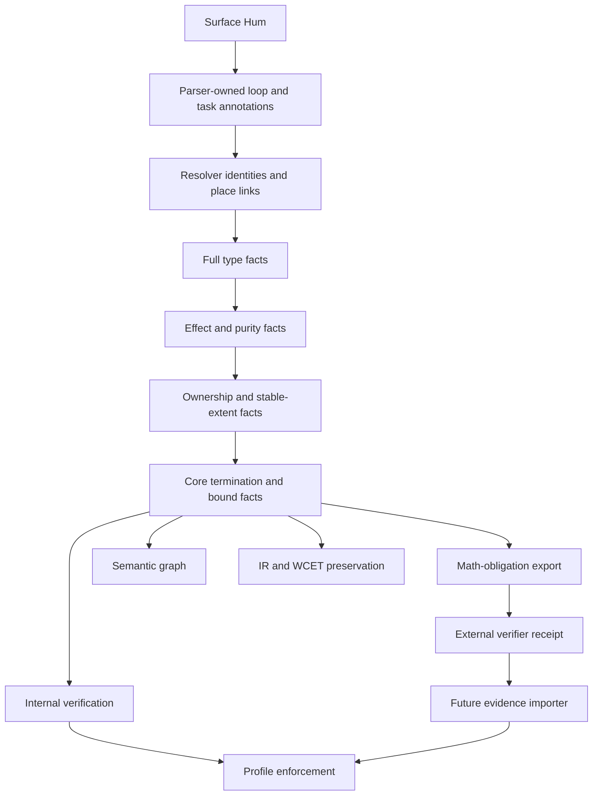

<!--
Research artifact imported on 2026-08-03.
Normalization: explicit UTF-8 decode, Deep Research UI citation markers stripped, typographic punctuation converted to ASCII, saved as UTF-8 without BOM.
Source names are preserved, but citation-only evidence cells may be blank; future runs should request direct source URLs in the Markdown body.
-->
# Termination Measures and Quantitative Loop Bounds for Hum

**Research date:** August 3, 2026
**Hum revision:** `hum-lang` at `6d859113ccd6a4a9f3af4ab4f2d38d972ae1f28e`
**Milo revision:** `milo-language/milo` at `cf390123ea383bc124934d14d019033ee7a9c72e`

This report evaluates the research brief's working hypothesis against repository implementation, executable tests, authoritative design documents, and primary documentation for comparable verification-oriented languages.

## Decision and repository ground truth

### Executive decision

**Adopt a deliberately narrow V0 consisting of three separate concepts:**

```hum
task countdown(n: UInt) -> UInt {
  decreases:
    n

  does:
    if n == 0 {
      return 0
    }
    return countdown(n - 1)
}
```

```hum
while i < limit {
  decreases:
    limit - i

  cost:
    iterations: at most limit

  set i = i + 1
}
```

```hum
for index i from 0 until list_len(items) {
  cost:
    iterations: exactly list_len(items)

  inspect(items[i])
}
```

The meanings must remain separate:

| Source concept | Meaning | Evidence class |
|---|---|---|
| `decreases:` | A well-founded progress measure used to prove local loop or direct-recursion termination | Correctness and totality obligation |
| `cost: iterations: at most E` | A quantitative upper bound on loop-body entries per activation | Resource-bound obligation |
| `cost: iterations: exactly E` | An exact loop-body-entry count, admitted in V0 only for structurally counted loops with no early or abnormal exit | Resource-bound obligation |
| `may diverge:` | Explicit task-level permission for intentional nontermination, with a human-readable reason; it never proves that divergence occurs | Intent and call-composition fact |
| Watchdog configuration | A separately classified fail-safe mechanism | Operational-policy evidence, never normal-termination proof |

The recommendation preserves the working hypothesis's most important distinction: **termination belongs outside `cost:`**. Hum's own design documents already treat contracts as obligations and `cost:` as a mixture of static-resource and benchmark claims; conflating a ranking function with a performance claim would contradict that separation. Hum's formal-core document assigns contracts and cost claims to different obligation roles, while its performance-contract document explicitly distinguishes static, proof, and benchmark tiers.

The exact V0 scope should be:

- one natural-number-valued measure;
- ordinary local `while` and unconditional `loop` back-edges;
- direct self-recursion only;
- pure expressions made from local or parameter values, integer constants, `+`, `-`, and approved stable-size operations such as `list_len`;
- structured `for index` and `for each` derivation when their range or extent is stable;
- `continue` treated as a back-edge;
- `break`, `return`, and typed failure treated as loop exits;
- explicit call-totality assumptions;
- honest `proved`, `refuted`, `conditional`, `unknown`, `unsupported`, `timeout`, and `invalid` outcomes.

The following should remain deferred:

- mutual and indirect recursion;
- recursion through task values, callbacks, or dynamic dispatch;
- lexicographic tuples;
- structural descent over recursive data;
- user-defined well-founded relations;
- general measure inference;
- concurrency-sensitive or scheduler-relative termination;
- wall-clock deadline proof;
- source-written exact counts for arbitrary `while` loops;
- automatic numeric bounds derived from arbitrary ranking functions;
- runtime enforcement of `decreases:`;
- `increases:`, `repeats:`, `bounds:`, or a dedicated `terminates:` section.

This is the smallest architecture-compatible design because Hum already has recognized loop statements, parser-owned canonical statement and expression identities, `cost:` resource inventories, math-obligation export, profiles, and a staged Core verification path. What it does not yet have is a sufficiently rich loop metadata representation or a termination verifier. A parser-only addition would therefore violate Hum's own rule that stable syntax must lower into precise Core facts and preserve semantic-graph evidence.

### Repository truth matrix

| Project | Commit | File or stable symbol | Observed fact | Status | Confidence |
|---|---|---|---|---|---|
| Hum | `6d859113...f28e` | `docs/ARCHITECTURE.md` | Hum's pipeline is intended to preserve source intent through Core, graph, checks, profiles, and evidence; new power must create new evidence.  | Authoritative architecture direction | High |
| Hum | `6d859113...f28e` | `docs/FORMAL_CORE.md`, "Core Statements" and "Loops" | The intended Core includes `while`, unconditional `loop`, `for each`, indexed loops, `break`, and `continue`; critical loops may carry `keeps:`, `changes:`, `watch for:`, and `cost:`. Profiles may eventually require variants, watchdogs, or measured bounds.  | Reference/future design, partly implemented | High |
| Hum | `6d859113...f28e` | `docs/LANGUAGE_REFERENCE.md` | Hum is pre-alpha and labels features as current, reference, alpha, future, or rejected. `cost:` is current and covers time, space, allocation, and checking claims.  | Current reference spine | High |
| Hum | `6d859113...f28e` | `docs/MILESTONE_0_GRAMMAR.md`, "Sections" | Item-level sections are currently recognized only at the containing item's fixed section indentation. The grammar does not yet define nested loop-attached sections.  | Implemented bootstrap grammar | High |
| Hum | `6d859113...f28e` | `CanonicalStatementKindEvent` | Parser-owned canonical statement kinds already distinguish `While`, `ForEach`, `ForIndexUntil`, `ForIndexThrough`, `UnconditionalLoop`, and block closure.  | Implemented | High |
| Hum | `6d859113...f28e` | `ParsedBodyStatementKind` | The public retained body representation is still coarse-`Return`, `Binding`, or `Other`-while richer loop facts live in canonical parser projections.  | Implemented but incomplete for proposed metadata | High |
| Hum | `6d859113...f28e` | `analyze_does_section`, `CORE_BODY_GRAMMAR_STATUS` | Core-body recognition is explicitly `partial_v0`; tests recognize a `while` header, mutable binding, update, and return, but there is no ranking-measure or iteration-bound semantics.  | Implemented partial grammar | High |
| Hum | `6d859113...f28e` | `docs/PERFORMANCE_CONTRACTS.md` | Hum distinguishes graph, warning, compile, proof, and benchmark enforcement tiers; benchmarks are not static proof.  | Aspirational design with current graph-level pieces | High |
| Hum | `6d859113...f28e` | `resource_report.rs::classify_claim` | Current resource reporting classifies `time:`, `space:`, allocation, check strategy, and generic cost claims. It does not recognize loop-iteration relations. All claims remain declared, not proved or measured.  | Implemented | High |
| Hum | `6d859113...f28e` | `hum.resource_report.v0` | Current resource claims explicitly carry `verification_status: declared`, `proof_status: not_proven`, and `benchmark_status: not_measured`.  | Implemented schema | High |
| Hum | `6d859113...f28e` | `hum.resource_check.v0` | The current resource checker is deliberately conservative and allocation-focused; accepted declarations are not proof.  | Implemented narrow gate | High |
| Hum | `6d859113...f28e` | `hum.math_obligation.v0` | Math obligations already preserve source spans, graph identities, normalized claims, assumptions, resource models, confidence, and solver budgets, but currently export only conservative allocation-freedom candidates.  | Implemented narrow exporter | High |
| Hum | `6d859113...f28e` | `docs/MATH_ENGINE_BOUNDARY.md` | Hum owns semantics and evidence policy; external verifiers return receipts and must preserve `proved`, `refuted`, `unknown`, `unsupported`, and `timeout`. Benchmarks, LLM explanations, and unchecked sketches are not proof.  | Authoritative architecture boundary | High |
| Hum | `6d859113...f28e` | `docs/RUNTIME_PROFILES.md` | Candidate strict profiles already discuss unbounded recursion, variants or watchdogs, WCET, stack bounds, blocking, and allocation. Current V0 profile mode remains contract-only rather than full enforcement.  | Documented policy; enforcement incomplete | High |
| Hum | `6d859113...f28e` | Work Orders 14-15 | Current repository work is tightly controlling parser-owned task-signature authority, Core lowering, Core verification, full-type authority, and acyclic stage dependencies. A termination feature must not bypass those canonical identities or introduce a reverse dependency.  | Active architecture constraint | High |
| Milo | `cf390123...a9c72e` | `TokenKind.Decreases`, `KEYWORDS` | `decreases` is a real keyword. `repeats`, `iterations`, and `increases` are not language keywords.  | Implemented | High |
| Milo | `cf390123...a9c72e` | `Contract`, `WhileStmt`, `ForInStmt` | Functions and loops store contracts; `decreases` is represented as an integer termination measure, separate from invariants.  | Implemented | High |
| Milo | `cf390123...a9c72e` | `verify.ts`, recursive termination VCs | For direct self-recursion, Milo proves the entry measure nonnegative and each self-call measure strictly smaller.  | Implemented | High |
| Milo | `cf390123...a9c72e` | `verify.ts`, loop variants | Loop variants are checked on completing and `continue` paths; `break` and `return` do not create back-edge obligations.   | Implemented | High |
| Milo | `cf390123...a9c72e` | `tests/prove/decreasesTermination.milo` | A decrementing countdown is expected to prove, while recursion on `n + 1` is expected to fail.  | Executable regression test | High |
| Milo | `cf390123...a9c72e` | `docs/site/language/safety.md` | Documentation correctly distinguishes loop invariants from `decreases` in the prover explanation, but elsewhere describes invariant-bearing loops as "bounded" for safety profiles.  | Partly accurate, partly misleading | High |
| Milo | `cf390123...a9c72e` | `checkUnboundedLoops` | Safety-profile enforcement accepts any `while` having at least one invariant; it does not require a variant or quantitative bound.  | Implemented but semantically insufficient for "bounded loop" | High |
| Milo | `cf390123...a9c72e` | `wcet.ts::whileBound` | The WCET extractor infers `N` for `i < N` and `N+1` for `i <= N` solely from a literal right side, while assuming-but not checking-zero initialization and unit increment.  | Implemented heuristic; unsound as a universal maximum | High |
| Milo | `cf390123...a9c72e` | `tests/wcet.test.ts` | WCET tests cover normal zero-start/unit-step cases and unresolved nonliteral ranges, but not negative starts, unchanged counters, reverse steps, mutable bounds, overflow, or early exits from literal ranges.  | Implemented but incomplete test envelope | High |
| Milo | `cf390123...a9c72e` | Early comment in `verify.ts` | A comment says Milo has no termination checker or `decreases` clause, while later code implements both.   | Stale contradiction | High |
| Milo | `cf390123...a9c72e` | Runtime contracts documentation | Runtime debug checks cover `requires`, `ensures`, and invariants; `decreases` is a static verification feature rather than a general runtime monitor.  | Implemented/documented | High |

The commit identities were verified at the current main-branch heads: Hum's head closes Work Order 14 and introduces the Work Order 15 design, while Milo's head concerns package target enforcement.

### Corrections to previous assumptions

The working hypothesis is largely sound, but it needs these corrections and qualifications.

**A ranking measure alone is not proof of whole-task completion.** It proves that a particular local back-edge or direct recursive descent cannot continue indefinitely, assuming the measure is safe to evaluate and all work performed between progress points completes. An iteration can call a blocking or divergent task before reaching its decrease. Verus explicitly describes executable termination checking as conditional on callees terminating, and Why3 propagates declared divergence to callers.

**Natural-number semantics should not be identified with unchecked machine-`UInt` arithmetic.** An expression such as `limit - i` is a valid mathematical natural only when `i <= limit`; otherwise the source evaluation can underflow or trap. SPARK's documentation makes the same point from the opposite direction: progress plus absence of runtime errors is needed to establish termination.

**`exactly` is materially harder than `at most`.** A structured range determines a maximum even when a `break`, typed failure, return, trap, or divergent call ends execution early. It determines an exact count only when all entries occur and no earlier outcome is possible. Milo's literal-range WCET extractor currently labels the cardinality exact without inspecting early exits, illustrating the danger.

**Hum cannot add loop-attached sections using only its existing generic section parser.** Current sections are item-level and fixed-indentation. Loops are recognized by canonical statement projections, but the retained public body representation is not yet a complete nested statement tree carrying arbitrary metadata. Loop `decreases:` and loop-local `cost:` therefore require a parser-owned block annotation model, not text scanning.

**Hum should explicitly classify intentional nontermination.** Normal Hum may allow unknown termination, but "not proved" does not reveal whether divergence is deliberate. Why3 uses a propagated `diverges` clause, Dafny uses `decreases *` for permitted nontermination, and F* distinguishes total computations from the divergent `Dv` effect. Hum's intent-first design benefits from a small `may diverge:` declaration, provided it remains a permission and composition fact rather than a proof.

**No evidence supports adding a Milo-inspired `repeats:` feature.** Milo has no `repeats`, `iterations`, or `increases` keyword; the implemented source construct is `decreases`, while quantitative counts are emitted by a separate WCET tool.

**Milo's safety-profile "bounded loop" rule is not evidence that invariants bound loops.** Its checker merely tests for the presence of an invariant, while its verifier separately understands `decreases`. Hum must not copy that mismatch.

## Normative semantic specification

### Semantic specification

The following wording is suitable as the normative basis of a V0 design.

#### Completion properties

Hum should distinguish four properties:

| Property | Normative meaning |
|---|---|
| `normal_completion` | Execution reaches an ordinary `return` or a typed `fail` in finitely many abstract-machine steps. |
| `local_progress` | A named loop cannot take infinitely many back-edges, or a directly self-recursive task cannot make an infinite chain of direct self-calls, assuming every intervening operation completes. |
| `finite_fail_stop` | Execution reaches an ordinary outcome or an explicitly classified fail-stop outcome such as a panic, trap, or abort in finitely many steps. This is not normal completion. |
| `deadline_completion` | Execution reaches an accepted outcome before a target- and scheduler-specific deadline. This requires timing, WCET, scheduling, and target evidence beyond termination. |

A successful `decreases:` proof establishes **local progress** for its owner. It contributes to `normal_completion` only if:

1. all reachable callees on relevant paths are proved normally total or appear as explicit assumptions;
2. no reachable operation can block indefinitely;
3. arithmetic, indexing, and other runtime-safety obligations needed to evaluate the guard, measure, and body are discharged;
4. recursive cycles outside the supported direct-self component are absent;
5. every nested loop on the path is itself normally terminating or an explicit dependency.

A panic, arithmetic trap, bounds trap, abort, watchdog shutdown, cancellation, process kill, or scheduler removal must not satisfy `normal_completion`. A profile may separately accept a proved or configured `finite_fail_stop` policy, but the evidence receipt must name that weaker property.

Permanent blocking, starvation, and infinite internal computation are all non-completion. A local decrease does not distinguish among them without call, effect, and scheduler facts.

#### Measure domain

V0 should define the semantic measure domain as the mathematical natural numbers:

\[
\mathbb{N} = \{0,1,2,\ldots\}.
\]

The accepted source expression type should initially be **`UInt` only**. This is narrower than the eventual mathematical model but is teachable and matches Hum's starter Core types. Signed integer measures and explicit lower-bound proofs should remain deferred.

The measure expression may contain:

- `UInt` parameters and locals;
- `UInt` constants;
- addition and subtraction;
- approved pure, total, compiler-known size operations such as `list_len(place)`;
- direct immutable fields after ordinary resolution and type checking.

The measure expression must not contain in V0:

- arbitrary task calls;
- IO, time, randomness, allocation, mutation, blocking, or foreign effects;
- indexing or dereference that can trap unless the checker already has a reusable proof of safety;
- task values, callbacks, dynamic dispatch, or closures;
- floating-point operations;
- multiplication of two nonconstant terms;
- mutable collection size unless stable extent is proved;
- an expression that is unsupported by the internal checker and has no valid external proof route.

The source expression is evaluated according to Hum's actual checked arithmetic. The verifier may translate it to mathematical integers, but it must generate separate obligations proving that every source-level operation is defined. A mathematical proof over `limit - i` is invalid if source evaluation can underflow.

#### Loop obligations

For a loop \(L\), let:

- \(G(s)\) be the loop guard in state \(s\);
- \(M(s)\) be the measure;
- \(B(s,s')\) mean that execution enters the loop body in \(s\), follows a path that reaches a normal back-edge, and arrives at the next guard state \(s'\);
- \(A(s)\) be all established preconditions, invariants, type facts, ownership facts, and explicit assumptions.

For every reachable loop entry state:

\[
A(s) \land G(s) \Rightarrow \operatorname{defined}(M(s)) \land M(s) \in \mathbb{N}.
\]

For every normal back-edge:

\[
A(s) \land G(s) \land B(s,s') \Rightarrow
\operatorname{defined}(M(s')) \land M(s') < M(s).
\]

The measure must therefore be nonnegative whenever the body may be entered and before every normal back-edge. It need not be evaluated after a path that exits by `break`, task return, or typed failure.

A `continue` is a normal back-edge. Every `continue` path must establish strict decrease. A branch that decreases by one and another that decreases by three is valid if each reachable back-edge proves strict decrease. A branch that exits needs no decrease. A branch that reaches the back-edge unchanged refutes the obligation.

For an unconditional `loop`, the same rules apply without a guard. If every body path exits and no back-edge is reachable, a measure is unnecessary and a written measure should be reported as vacuous rather than misleadingly "proved."

A loop-local progress proof is **conditional** if a path to its next progress point invokes a callee whose normal completion is assumed rather than proved. It is `unknown` if the current analysis cannot express or decide the required condition. It is `unsupported` when the program uses a V0-excluded shape, such as concurrency-sensitive progress.

#### Direct self-recursion obligations

For a task \(f\) with parameters \(\vec{x}\), measure \(M_f(\vec{x})\), and direct self-call \(f(\vec{x}')\), V0 generates:

\[
\text{Pre}_f(\vec{x}) \Rightarrow
\operatorname{defined}(M_f(\vec{x})) \land M_f(\vec{x}) \in \mathbb{N},
\]

and, at each reachable direct self-call:

\[
\text{PathConditions} \Rightarrow
\operatorname{defined}(M_f(\vec{x}')) \land
M_f(\vec{x}') < M_f(\vec{x}).
\]

Only direct calls whose resolved definition identity is the current task qualify. Name equality is insufficient because of shadowing, imports, and future overload-like surfaces.

Hum may use the task's own `ensures:` clauses inductively at a direct self-call only if:

1. the call resolves to the exact same task definition;
2. that task has a valid `decreases:` declaration;
3. the termination VCs for every direct self-call are generated;
4. no unsupported indirect or mutual recursive edge belongs to the same recursive component;
5. the proof result using the inductive hypothesis is withheld or marked conditional until the termination obligation is proved.

This is the soundness principle implemented in mature deductive systems: recursive postconditions may be used as induction hypotheses only over a well-founded descent. Milo's verifier now enforces this for direct self-recursion, while Verus's documentation illustrates why accepting a nonterminating recursive specification can prove falsehood.

Mutual recursion, indirect recursion, and recursion through task values must return `unsupported` in V0 when a proof is requested. They must never be silently treated as acyclic. SPARK, Dafny, and Verus support compatible or lexicographic measures across mutually recursive components, but that machinery is beyond the smallest Hum design.

#### Calls and effects

Each termination receipt must inventory call-totality dependencies. A callee status composes as follows:

| Callee fact | Caller termination effect |
|---|---|
| Proved `normal_completion` | May be used without an additional assumption |
| Declared total but not proved | Caller result becomes `conditional` |
| Unknown | Caller is `conditional` if the unknown is explicitly assumed; otherwise `unknown` |
| Refuted or declared `may diverge` | Caller cannot be proved normally total along a reachable path |
| Foreign or opaque call | `conditional` only under a named trust assumption; strict profiles may reject |
| Blocking IO or lock acquisition | Local progress may be proved, but normal or wall-clock completion remains conditional or unknown |
| Callback or dynamic task value | Unsupported for V0 totality unless the exact target is statically closed and proved |
| Concurrent operation | Unsupported for V0 normal completion absent a scheduler model |

The evidence must name, rather than hide, assumptions such as:

```json
{
  "assumption_kind": "callee_normal_completion",
  "callee_definition_id": "task:module:read_message",
  "basis": "declared_not_proved",
  "effects": ["block", "network"]
}
```

#### Intentional nontermination

V0 should add the optional task-level declaration:

```hum
task serve_forever(socket: Socket) -> Result Unit, ServiceError {
  may diverge:
    event service loop; shutdown is controlled by the host

  does:
    loop {
      handle_next(socket)
    }
}
```

Normative rules:

- `may diverge:` permits but does not prove divergence.
- It is mutually exclusive with a task-level claim that the same task is normally total.
- A caller cannot be proved normally total if a reachable path calls a `may diverge` task and subsequently requires completion.
- The reason line is preserved as graph evidence but does not alter control semantics.
- Normal profile permits it.
- Strict profiles may reject it, isolate it to a designated control-loop boundary, or require a separately classified watchdog/fail-safe policy.
- `ensures:` remains a partial-correctness claim: if the task returns or typed-fails, the relevant postcondition must hold.
- Agent tooling should distinguish `intentional_may_diverge` from `termination_unproved`.

This follows the intent of Why3's propagated `diverges`, Dafny's `decreases *`, and F*'s explicit divergent effect, while using Hum's section-oriented source style.

### Quantitative iteration bounds

#### Counting model

One iteration is **one entry into the loop body, per dynamic activation of that syntactic loop**.

This definition gives stable answers:

- an empty range has zero iterations;
- a `continue` does not create an extra iteration beyond the body entry already counted;
- a `break`, task return, typed failure, panic, or trap ends the count after entries already made;
- guard evaluations are not counted as iterations;
- nested loops have separate activation-local counts;
- re-entering the same syntactic loop through a later task call is a new activation;
- retrying an entire task is not another iteration of the prior activation.

Condition-check counts and back-edge counts may later be derived as separate metrics. They should not be folded into `iterations` because WCET tools can need both body executions and test executions.

#### Upper bounds

For loop \(L\), bound expression \(N\), and activation-entry state \(\sigma_0\):

```hum
cost:
  iterations: at most N
```

means:

\[
\forall \pi \in \operatorname{Executions}(L,\sigma_0):
\quad \operatorname{bodyEntries}(L,\pi) \le
\llbracket N \rrbracket_{\sigma_0}.
\]

The bound is evaluated in a **loop-entry snapshot**, not task entry and not dynamically on each iteration.

Thus:

```hum
cost:
  iterations: at most list_len(items)
```

means the length observed immediately before that loop's first guard or range evaluation. The Core fact should preserve a snapshot identity even if no source-level `loop_entry(...)` syntax is exposed.

Free places in the bound are snapshot values. The bound remains meaningful if the live variable later changes, but the checker must prove that taking the snapshot itself is valid and that the control argument really relates later behavior to the snapshot. A merely changing variable with the same name is not enough.

For collection bounds, ownership analysis should derive stable extent only when:

- the loop owns an immutable borrow or equivalent stable view;
- no reachable operation can structurally mutate the collection;
- no mutable alias escapes to a callee;
- no callback can mutate it;
- the iterator's extent semantics are pinned.

A structurally mutating loop may still use an explicit snapshot-derived bound if the proof relates every body entry to that snapshot, but it must not rely on the live length silently.

#### Exact counts

```hum
cost:
  iterations: exactly N
```

means:

\[
\forall \pi \in \operatorname{Executions}(L,\sigma_0):
\quad \operatorname{bodyEntries}(L,\pi) =
\llbracket N \rrbracket_{\sigma_0}.
\]

V0 should accept this only when the compiler can prove all of the following:

- the loop is a structurally counted `for index` or stable-extent `for each`;
- the range cardinality equals the declared expression;
- no `break`, task return, or typed failure can leave early;
- no panic, trap, or abort can occur before the expected entries;
- every called operation before the final expected entry completes normally;
- the range or collection extent cannot change;
- endpoint arithmetic is safe and has defined empty/reversed-range semantics.

A source-written exact claim on an arbitrary `while` should be parsed and preserved but classified `unsupported_v0_exact_while`, rather than guessed.

An early exit does not contradict `at most`; it generally contradicts `exactly`. A divergent call before the expected final entry makes exactness `unknown` or `conditional`, not proved. An arithmetic trap before the final expected entry refutes normal exact-count semantics.

V0 does not need `iterations: at least`. It adds little to WCET or denial-of-service control, and the main plausible use-minimum work performed-belongs closer to functional or liveness postconditions.

#### Structured-loop derivations

A `for index i from A until B` loop can derive:

\[
\text{cardinality} = \max(0,B-A)
\]

provided endpoint values are snapped at loop entry and subtraction is represented mathematically rather than by underflowing source arithmetic.

The compiler may derive:

- `at_most(cardinality)` unconditionally from the structured range, even with early exits;
- `exactly(cardinality)` only after proving no early or abnormal exit and completion of every body activation.

A stable `for each` can similarly derive `at_most(snapshot(list_len(collection)))`. It may derive exactness only if iterator semantics guarantee one body entry per original element and structural mutation and early exit are absent.

An exact bound implies the corresponding upper bound. The graph must preserve both the source or derived exact fact and the separately derived upper-bound fact.

A finite iteration upper bound does **not** by itself prove loop completion: one body activation may block or diverge. It proves only that there cannot be more than \(N\) body entries.

A ranking measure does not automatically yield a simple V0 numeric bound. If the initial measure is \(M_0\), strict descent over naturals limits the number of successful back-edges, but body-entry bounds depend on whether the initial guard is true, whether exit occurs before another edge, and how the measure relates to the guard. V0 should therefore avoid deriving `iterations` from `decreases:`.

An iteration bound does not automatically determine asymptotic task cost. The body may contain nested loops or calls with their own cost. Any future complexity composition must preserve its derivation tree rather than replacing a local bound with an unexplained `O(...)` label.

## Syntax and comparative design

### Syntax decision matrix

Scores use five as best. "Parser feasibility" assesses an honest parser/Core implementation, not the ease of text matching.

#### Termination syntax

| Alternative | Clarity | Hum consistency | Parser feasibility | Tooling and spans | Semantic separation | Extensibility | Burden | Decision |
|---|---:|---:|---:|---:|---:|---:|---:|---|
| **A. Task/loop `decreases:`** | 5 | 5 | 3 | 5 | 5 | 4 | 4 | **Adopt** |
| B. `proves: termination by n` | 3 | 3 | 4 | 3 | 3 | 3 | 3 | Reject |
| C. `cost: decreases: n` | 2 | 4 | 4 | 4 | 1 | 3 | 4 | Reject |
| D. `terminates: decreases n` | 4 | 3 | 4 | 4 | 5 | 4 | 2 | Reject as redundant |
| E. Inline `while ... decreases ...` | 3 | 2 | 2 | 3 | 5 | 3 | 4 | Reject |

Design A wins because it uses one canonical term already established across verification-oriented tools and reads as an independent contract. It also places loop metadata close to the loop while retaining Hum's section-based visual style. Dafny, Milo, and Verus all use `decreases`; SPARK and Why3 use the closely related "variant" terminology.

Design B improperly puts a proof strategy inside `proves:`. A measure is a source-level obligation, not evidence that it has already been proved. Design C confuses total correctness with performance. Design D adds two words for one concept and raises future questions about `terminates: by`, `terminates: unless`, or other subgrammar. Design E conflicts with Hum's line-oriented, progressively disclosed source style and would complicate formatter and parser recovery.

#### Bound syntax

| Alternative | Clarity | Existing Hum fit | Loop locality | Graph normalization | Confusion risk | Decision |
|---|---:|---:|---:|---:|---:|---|
| **Nested `cost: iterations: at most N`** | 5 | 5 | 5 | 5 | 1 | **Adopt** |
| `bounds: iterations: at most N` | 4 | 2 | 5 | 5 | 2 | Reject new top-level concept |
| `iterations: at most N` | 4 | 3 | 5 | 4 | 2 | Reject as an unnecessarily specialized section |
| `repeats: at most N` | 2 | 1 | 5 | 3 | 4 | Reject |

`iterations` names the measured quantity, while `at most` or `exactly` names the relation. `repeats` is less precise because the first body execution is not naturally a "repeat," and it has no implementation precedent in Milo.

#### Canonical formatting

```hum
while cursor < list_len(items) {
  decreases:
    list_len(items) - cursor

  cost:
    iterations: at most list_len(items)

  process(items[cursor])
  set cursor = cursor + 1
}
```

Rules:

- loop annotations appear first inside the loop body;
- order is `decreases:`, then `cost:`, then executable statements;
- one blank line separates annotation blocks and executable statements;
- `decreases:` has exactly one meaningful V0 expression line;
- a loop `cost:` block may contain one `iterations:` line in V0;
- annotations are children of the exact parser-owned loop node, not executable statements;
- formatter movement must preserve source-origin identity or emit a stable remapping;
- duplicate or misplaced annotation blocks are errors;
- loop annotations do not create a lexical scope.

#### Required examples

**Growing recursion, refuted**

```hum
task runaway(n: UInt) -> UInt {
  decreases:
    n

  does:
    return runaway(n + 1)
}
```

**Bounded while**

```hum
change i: UInt = 0

while i < limit {
  decreases:
    limit - i

  cost:
    iterations: at most limit

  set i = i + 1
}
```

**Stable collection**

```hum
for each item in items {
  cost:
    iterations: exactly list_len(items)

  inspect(item)
}
```

Exactness is accepted only when `items` has stable extent, iteration visits each element once, and the body contains no early or abnormal exit.

**Early break**

```hum
for each item in items {
  cost:
    iterations: at most list_len(items)

  if item.matches {
    break
  }
}
```

The compiler may derive the upper bound, but not exactness.

**Opaque call**

```hum
while pending > 0 {
  decreases:
    pending

  process_opaque()
  set pending = pending - 1
}
```

Local descent can be proved; normal completion is `conditional` or `unknown` because `process_opaque` has no proved totality.

**Intentional service loop**

```hum
task serve(queue: Queue) -> Result Unit, ServiceError {
  may diverge:
    service loop ends only through host shutdown

  does:
    loop {
      handle_next(queue)
    }
}
```

**Watchdog-controlled loop**

```hum
task control_loop(device: Device) -> Result Unit, ControlError {
  may diverge:
    continuous embedded control loop

  protects:
    watchdog requests safe stop after missed heartbeat

  does:
    loop {
      heartbeat()
      update(device)
    }
}
```

The watchdog is fail-safe evidence, not proof that the loop returns or typed-fails.

**Strict-profile rejection**

```text
error: profile `hard realtime` requires a proved finite iteration maximum
  at controller.hum:42:3
  loop has a proved decreasing measure, but no concrete `iterations: at most ...` bound
help: declare and prove a loop-entry bound, or move this loop outside the realtime region
```

### Comparative prior art

| System | Syntax and measure | Loops and recursion | Intentional divergence | Adopt for Hum | Avoid in V0 |
|---|---|---|---|---|---|
| Milo | `decreases <integer expression>` | Direct self-recursion and loop variants; nonnegative and strictly smaller VCs; loop `continue` paths included.   | No comparably explicit source construct found in the keyword inventory | Simple terminology, separate invariants and variants, explicit unknown | WCET syntax heuristics; treating any invariant as bounded-loop evidence |
| SPARK | `Loop_Variant` and `Subprogram_Variant`, with increasing, decreasing, lexicographic, or structural components | Supports loops and compatible variants across mutual recursion; termination also requires absence of runtime errors.  | `Always_Terminates` selects stronger totality requirements | Separate progress and runtime-safety obligations; explicit call composition | Increasing, structural, and tuple variants in V0; assertion-policy runtime complexity |
| Dafny | `decreases E`, tuple measures, inferred variants; `decreases *` permits nontermination | Loops, direct and mutual recursion; structured finite `for` loops need no explicit measure.  | `decreases *`, propagated through containing methods | Distance-to-bound idiom; structured-loop derivation; explicit opt-out | Broad inference, multiple measure domains, tuples, and implicit guesses in V0 |
| Why3 | `variant { E }`, optionally with a custom well-founded relation | Generates termination VCs by default; custom relations possible.  | Explicit `diverges` propagated to callers | Propagated divergence and explicit custom-proof boundary | Custom relations and default mandatory totality for ordinary Hum |
| F* | Total `Tot` computations require termination; `decreases` assists recursive proof | Rich dependent/refinement proof system | `Dv` computations have partial-correctness semantics.  | Clear semantic distinction between total and possibly divergent computations | Effect-system and proof-term machinery unnecessary for V0 |
| Verus | `decreases` for recursive spec/proof functions and lightweight executable checking; lexicographic and mutual variants available | Executable checking is conditional on callees terminating.  | Attribute can permit missing executable decreases | Honest conditional status and explicit recursion soundness rationale | Treating executable termination as a lint without complete call-totality evidence in strict profiles |

The prior art supports a consistent conclusion: Hum should adopt the familiar one-measure `decreases:` surface, but it should keep the sophisticated domains and inference strategies out of V0. It should also make call-totality assumptions more visible than lightweight executable checkers commonly do.

## Core, evidence, and profile model

### Core and evidence model

The proposed pipeline is:



This follows Hum's existing architecture rule that parser-owned identities are transported through Core rather than reconstructed downstream. The current Work Order design also enforces an acyclic dependency order from AST and resolution through Core verification and full-type checking.

#### Core facts

**`CoreTerminationVariantV0`**

```text
id
owner_kind: loop | direct_self_recursion
owner_definition_id
loop_node_id: optional
source_span
source_expression_node_id
resolved_expression
domain: nat
source_type: UInt
relation: strictly_decreases
evaluation_phase:
  loop_back_edge | direct_self_call
allowed_operations
purity_fact_ids
ownership_fact_ids
call_totality_dependencies
arithmetic_safety_obligations
origin: declared
verification_status
```

**`CoreLoopIterationBoundV0`**

```text
id
loop_node_id
owner_definition_id
source_span
metric: body_entries_per_activation
relation: at_most | exactly
bound_expression_node_id
resolved_bound_expression
snapshot_id
snapshot_phase: loop_entry
stable_extent_fact_ids
origin: declared | compiler_derived | profile_required
verification_status
derivation_parent_ids
```

**`CoreTerminationIntentV0`**

```text
owner_definition_id
intent: unspecified | may_diverge
reason_lines
source_span
propagation_status
```

**`CoreTerminationDependencyV0`**

```text
caller_owner_id
call_site_id
callee_definition_id or opaque_target_id
required_property: normal_completion
basis: proved | declared | assumed | unknown | may_diverge
effects
trust_class
```

**`CoreWatchdogPolicyV0`**

This must remain a policy or protection fact, not a termination fact:

```text
owner_definition_id
watchdog_identity
trigger_policy
safe_stop_target
configuration_evidence
verification_status
satisfies:
  fail_safe_policy
does_not_satisfy:
  normal_completion
  iteration_bound
  wcet
```

#### Stage ownership

| Responsibility | Recommended owner |
|---|---|
| Recognize task `decreases:`, `may diverge:`, and loop annotation blocks | `parser.rs` plus syntax metadata |
| Preserve exact annotation, expression, loop, block, and source identities | `ast.rs` parser-owned canonical structures |
| Resolve names, places, task definitions, and self-call identity | `resolve.rs` |
| Validate `UInt` type and approved expression forms | Shared typed-expression authority consumed by `full_type_check.rs` |
| Validate purity, total built-ins, and effect-free measure evaluation | `effect_check.rs` |
| Establish immutable place or stable collection extent | `ownership_check.rs` |
| Construct typed Core facts | `core_lower.rs`, consuming-not recomputing-the prior facts |
| Check internal structural and arithmetic obligations | `core_verify.rs` or a narrow new `termination_check.rs` consumed by Core verify |
| Classify declared and derived iteration claims | `resource_report.rs` and `resource_check.rs` |
| Export solver-facing obligations | `math_obligations.rs` |
| Apply profile requirements | `profile_check.rs` |
| Expose source, Core, obligation, and status facts | `graph.rs` |
| Provide hover, formatting, semantic tokens, and completion | `syntax.rs`, formatter, and LSP surfaces |
| Preserve bounds for backend/WCET tools | Core-lower and future IR contract |
| Optional debug monitoring | Deferred runtime work; never a substitute for static proof |

A new `termination_check.rs` is justified only if it is the **single producer** of a memoized termination analysis consumed by Core verification, graph output, profile checking, and obligation export. Independent loop analyses in resource, profile, and graph modules would recreate the inconsistency seen in Milo's separate verifier, safety checker, and WCET extractor.

> **[Editorial note, added 2026-08-03: superseded in part.]** The two rows above
> that place termination obligations in `core_verify.rs`, or have a
> `termination_check.rs` consumed by Core verification, are superseded by
> accepted decision 0020. The dependency direction was verified in source:
> `core_verify` does not import full-type, effect, or ownership, while
> `full_type_check` imports `core_verify`. Termination checking needs typed
> expressions and effect and ownership facts, so consuming it from Core
> verification would invert that direction and create a cyclic stage
> dependency. Decision 0020 places `termination check` after ownership
> checking and before resource checking. The single-producer principle stated
> here is retained and is normative in that decision; only the stage placement
> is superseded.

#### Graph facts

The semantic graph should expose at least:

```json
{
  "kind": "termination_variant",
  "id": "termination_variant:...",
  "owner": "task:...",
  "scope": "loop",
  "loop_node_id": "stmt:...",
  "source_expression_node_id": "expr:...",
  "domain": "nat",
  "relation": "strictly_decreases",
  "verification_status": "not_attempted"
}
```

```json
{
  "kind": "loop_iteration_bound",
  "id": "loop_bound:...",
  "loop_node_id": "stmt:...",
  "metric": "body_entries_per_activation",
  "relation": "at_most",
  "snapshot": "loop_entry:snapshot:...",
  "origin": "declared",
  "verification_status": "not_attempted"
}
```

Derived facts must retain `derivation_parent_ids`. A derived `at_most` from `exactly` must not overwrite the exact source claim.

#### Obligation payloads

Termination and resource bounds should use specialized payloads under a versioned common envelope rather than forcing them into the allocation-freedom payload shape.

```json
{
  "schema_version": "hum.math_obligation.v1",
  "obligation_id": "hum_obl_termination_...",
  "obligation_kind": "termination",
  "scope": "loop",
  "claim_origin": "declared",
  "source_span": {},
  "graph_node_id": "stmt:...",
  "normalized_formal_claim": {
    "representation": "hum_ranking_function_v0",
    "measure_expression_id": "expr:...",
    "domain": "nat",
    "relation": "strictly_decreases",
    "progress_points": "normal_back_edges"
  },
  "assumptions": [],
  "call_totality_dependencies": [],
  "relevant_effects": [],
  "verification_result": "not_attempted"
}
```

```json
{
  "schema_version": "hum.math_obligation.v1",
  "obligation_id": "hum_obl_loop_bound_...",
  "obligation_kind": "loop_iteration_bound",
  "claim_origin": "declared",
  "source_span": {},
  "graph_node_id": "stmt:...",
  "normalized_formal_claim": {
    "representation": "hum_loop_bound_v0",
    "metric": "body_entries_per_activation",
    "relation": "<=",
    "bound_expression_id": "expr:...",
    "snapshot": "loop_entry"
  },
  "assumptions": [],
  "verification_result": "not_attempted"
}
```

The existing `hum.resource_report.v0` should advance to a version that recognizes:

- `loop_iteration_upper_bound`;
- `loop_iteration_exact_count`;
- claim relation;
- loop identity;
- loop-entry snapshot;
- source or derived origin;
- related math-obligation ID.

The existing honesty fields must remain. Current Hum correctly reports source resource claims as declared, not proved or measured.

#### Exact status enums

**Claim origin**

```text
declared
compiler_derived
profile_required
```

**Verification result**

```text
not_attempted
proved
refuted
conditional
unknown
unsupported
timeout
invalid
```

Meanings:

- `conditional`: established only under listed unproved or trusted assumptions;
- `unknown`: the obligation is expressible, but the checker or solver cannot decide it;
- `unsupported`: V0 has no semantics or translation for the program shape;
- `invalid`: malformed declaration, wrong type, stale or invalid receipt, or internally inconsistent payload;
- `refuted`: a concrete counterexample or sound contradiction exists.

**Evidence kind**

```text
static_structural_derivation
internal_checker
external_solver_receipt
runtime_observation
benchmark_measurement
watchdog_configuration
wcet_tool_receipt
review_only
```

#### Evidence admissibility

| Evidence kind | Local progress | Universal iteration bound | Exact count | WCET | Deadline | Watchdog/fail-safe |
|---|---:|---:|---:|---:|---:|---:|
| Static structural derivation | Yes, for supported structured loops | Yes | Yes, only under no-early-exit conditions | No | No | No |
| Internal checker | Yes | Yes | Yes | No | No | No |
| Accepted external solver receipt | Yes | Yes | Yes | No by itself | No | No |
| Runtime observation | No | No | No | Measurement only | Measurement only | Exercise evidence only |
| Benchmark measurement | No | No | No | Empirical input/target evidence | Empirical evidence only | No |
| Watchdog configuration | No | No | No | No | No | Yes |
| WCET tool receipt | No normal-totality proof by itself | May consume a proved bound | No source exactness unless independently justified | Yes under its target model | Contributes with scheduler evidence | No |
| Review only | No | No | No | No | No | Policy approval only |

#### Receipt requirements

Every proof or refutation receipt must carry:

- obligation ID;
- source span and graph identity;
- compiler and schema versions;
- verifier name, version, configuration, and trust class;
- assumptions used;
- timeout, memory, and step budgets;
- result status;
- counterexample when refuted;
- certificate or independently checkable trace when required by profile;
- active profile and target;
- relevant effects;
- call-totality dependencies;
- source, dependency, compiler, profile, target, verifier, and configuration digest;
- stale-evidence key;
- issue time and optional expiry policy.

Hum's architecture already requires cache and evidence identity to account for source, dependencies, compiler, profile, target, verifier, configuration, and environment.

### Profile matrix

The following are **recommended Hum policies**, not claims that the named external standards mandate these exact language rules.

| Profile | Missing evidence | Unknown allowed | Recursion | Loop variant | Concrete maximum | Watchdog role | WCET | Callee totality | Allocation/blocking interaction |
|---|---|---|---|---|---|---|---|---|---|
| `normal` | Allowed | Yes | Allowed | Optional | Optional | Operational only | No | Conditional accepted and surfaced | Does not invalidate local progress; may prevent whole-task totality |
| `embedded no heap` | Allowed outside designated finite tasks | Yes with warning | Direct recursion allowed only with stack-depth policy; stricter deployments may forbid | Required for loops claimed total | Required where resource budget demands | May satisfy fail-safe policy only | Optional | Required for any task claimed normally total | Allocation forbidden independently; blocking usually unavailable |
| `engine hot path` | Allowed outside hot region | Usually no for declared hot-path bound | Prefer no recursion; otherwise bound depth | Required for data-dependent hot loops | Required per-frame or per-job | Not a performance proof | Target profiling required; static WCET optional | Hot-path calls need bounded cost and completion assumptions | Per-frame allocation or blocking invalidates hot-path acceptance |
| `hard realtime` | Not allowed in realtime region | No | Usually forbidden or requires proved depth and stack bound | Required unless structured finite loop derives termination | Required | Required where system policy says so, but cannot replace proof | Required or an accepted conservative timing bound | All callees must be target-total and nonblocking | Dynamic allocation, blocking IO, unbounded locks, and opaque calls invalidate deadline claim |
| `safety critical` | Not allowed for designated critical functions | No | Profile may forbid; otherwise direct recursion requires termination and depth proof | Required for non-structural loops | Required when resource exhaustion or timing matters | Separate fail-safe evidence | Required if timing is a safety requirement | All critical callees total or explicitly isolated/trusted | Hidden allocation/blocking invalidates relevant assurance claims |
| `medical class c` | Not allowed on safety-related control paths | No | Prefer forbidden; exceptions require traceable proof and depth evidence | Required | Required for safety/time-critical loops | Required where risk control calls for it; separately traced | Required for deadline-sensitive functions | Full dependency traceability | Allocation and blocking need explicit budget and risk control |
| `automotive asil d` | Not allowed on ASIL-D paths | No | Prefer forbidden or tightly proved | Required | Required for bounded execution paths | Separate safety mechanism | Required for deadline-controlled elements | Totality and interference assumptions required | Dynamic allocation, locks, and blocking require explicit bounded models |
| `certified toolchain` | Not allowed where proof is required | No | Whatever the selected certified subset permits | Required by selected subset | Required when policy says bounded execution | Configuration evidence only | Only from qualified/accepted tool route | Every proof dependency must be qualified or trusted explicitly | Tool and runtime models must match the evidence receipt |

A finite loop bound can mitigate denial-of-service and resource-exhaustion risk, but it must remain separate from:

- eventual completion;
- per-iteration completion;
- WCET;
- deadline satisfaction;
- allocation freedom;
- stack bounds;
- recursion depth;
- lock-wait bounds;
- watchdog recovery.

Hum's current profile document already separates several of these concerns and identifies hard realtime as requiring deadline, WCET, stack, scheduler, and watchdog evidence-not merely a syntactic loop restriction.

## Soundness and adversarial validation

### Soundness risks

The principal risks are not parser bugs but **false upgrades of evidence**.

| Risk | False claim produced | Required defense |
|---|---|---|
| Treating an invariant as progress | "Bounded loop" despite unchanged or increasing state | Separate `keeps:`/invariant and `decreases:` facts and VCs |
| Inferring `i < N` means at most `N` | Wrong for negative starts, reverse steps, unchanged counters, or mutable `N` | Require structured range derivation or prove initialization, update, stability, and arithmetic |
| Ignoring `continue` | A path can skip the update forever while other paths decrease | Treat every reachable `continue` as a back-edge |
| Treating early exits as compatible with exactness | Exact count accepted despite `break`, return, or typed failure | Exact-count control-flow check |
| Ignoring divergent or blocking callees | Local descent upgraded to normal or wall-clock completion | Call-totality and effect dependencies |
| Modeling machine arithmetic as mathematical naturals | Underflow or overflow invalidates measure evaluation | Separate arithmetic-safety VCs |
| Reading live collection length as a fixed bound | Structural mutation invalidates the control argument | Loop-entry snapshot and ownership-derived stability |
| Trusting source spelling rather than resolver identity | Shadowed or indirect call mistaken for self-recursion | Definition-ID-based recursion detection |
| Silently dropping unsupported paths | "Proved" result with an absent VC | Emit `unknown` or `unsupported` for every untranslatable obligation |
| Treating a literal range as exact despite exits | False exact flow fact | Derive at most first; derive exact only with exit analysis |
| Treating a benchmark as a universal bound | Tested inputs mistaken for all executions | Evidence-kind admissibility matrix |
| Treating watchdog firing as termination | External kill mistaken for normal return/failure | Separate watchdog and fail-stop facts |
| Accepting stale receipts | Proof for old source/compiler/profile reused | Complete stale-evidence key |
| Duplicating analysis by command | Graph, profile, verifier, and WCET disagree | One shared Core fact and analysis producer |
| Letting strict profiles accept `conditional` silently | Assurance depends on hidden trust | Profiles require empty or explicitly approved assumption sets |

Milo provides concrete cautionary examples. Its verifier handles variants separately and substantially correctly, but its safety checker labels invariant-bearing loops bounded, and its WCET extractor infers maxima from guard syntax without validating the assumed initialization and step.

By code inspection, Milo's `whileBound` would report a maximum of five for `while i < 5` even if `i` starts at `-100`, despite 105 unit-increment body entries. It would also report a finite bound for an unchanged or decreasing counter. These are findings about the standalone WCET extractor, not Milo's separate termination verifier.

### Adversarial test matrix

| Case | Expected classification | Required assumption | Diagnostic or evidence result |
|---|---|---|---|
| `countdown(n - 1)` | `proved` | `n > 0` on recursive branch; subtraction safe | Direct-self termination receipt |
| `runaway(n + 1)` | `refuted` | None | Counterexample showing new measure is larger |
| Direct recursive call with unchanged `n` | `refuted` | None | "measure does not strictly decrease" |
| `while i < limit`, measure `limit - i`, `i += 1` | `proved` | `i <= limit`; arithmetic safe; no divergent work before edge | Loop progress proof |
| `continue` before `i += 1` | `refuted` | Continue path reachable | Related span points from `continue` to measure |
| Branches decreasing by one or three | `proved` | Every back-edge branch proves a positive decrease | One VC per path or equivalent joined proof |
| Early `break` | Termination may prove; exact count unavailable | None for exit path | `at_most` preserved; exact is refuted or invalid |
| Task `return` inside loop | Same as early break | None | Exact-count contradiction points to return |
| Typed failure inside loop | Counts entries already made; normal completion can still hold | Typed failure is an ordinary declared outcome | Exact count generally fails; termination may still prove |
| Mutable collection length in measure | `refuted`, `unknown`, or invalid | Stable-extent ownership fact absent | "measure depends on structurally mutable collection" |
| Append during iteration | Usually ownership rejection before termination; otherwise unstable | No mutable alias or explicit snapshot proof | Ownership blocker linked to bound obligation |
| Opaque call inside loop | Local progress `conditional` or `unknown` | Callee normally completes | Assumption listed in receipt |
| Blocking call inside loop | Local progress may prove; normal completion not proved | Bounded-wait or scheduler model | Effect dependency prevents totality upgrade |
| `UInt` subtraction may underflow | `invalid` or `refuted` | Need `i <= limit` | Arithmetic-safety obligation fails |
| Signed measure with no lower bound | `invalid` in V0 | Not applicable | "V0 measure must have source type UInt" |
| Mutual recursion | `unsupported` | None | Component members listed |
| Higher-order recursion through task value | `unsupported` | None | Indirect target and call-site identity reported |
| Literal range with early break | `at_most` proved; `exactly` refuted | Range endpoints safe | Derived cardinality retained as maximum |
| Empty range | `exactly 0` if endpoint semantics are proved | Defined range normalization | Structural derivation receipt |
| Nested loops | Separate local bounds | Inner bound valid on every outer activation | Product only as an explicit derived fact with parents |
| Start `-100`, guard `< 5` | Never infer maximum five | Need initialization and transition proof | Heuristic derivation prohibited |
| Unchanged counter, guard `< 5` | No finite maximum | None | Ranking proof refuted |
| Non-unit positive step | May prove with explicit measure; bound needs arithmetic derivation | Monotonic safe update | No guard-only heuristic |
| Negative step | Usually refuted or unknown | None | Measure fails to decrease |
| Bound variable mutates | Unknown/refuted unless snapshot relation proved | Loop-entry snapshot and transition facts | Unstable-bound diagnostic |
| Overflow in counter update | Normal completion not proved | Absence-of-overflow proof | Arithmetic VC |
| Verifier timeout | `timeout` | None | Never converted to unknown or success |
| Invalid proof certificate | `invalid` | None | Profile rejects receipt |
| Source/compiler/profile changed | Receipt `invalid_stale` | Matching stale-evidence key required | Receipt discarded |
| Watchdog fires | Fail-safe observation | Watchdog identity and configuration | No termination proof generated |
| Trap before declared exact bound | Exact count `refuted` | None | Trap site related to exact claim |
| Measure decreases, body calls divergent task | Local progress proved; task completion not proved | Divergent callee excluded or replaced | `conditional`/`refuted` composition |
| Stable finite `for each` | Termination and maximum compiler-derived | Stable extent and iterator totality | `at_most len_entry`; exact only without exits |
| `for index` with known endpoints, no exits | Exact count compiler-derived | Safe endpoint normalization and total body calls | Exact and derived at-most facts |
| Foreign call in body | Conditional or unsupported by profile | Trusted totality contract | Trust assumption in receipt |
| Cancellation | External outcome only | Explicit cancellation semantics | Does not satisfy normal completion |
| Scheduler starvation | Not proved | Fairness model would be needed | Unsupported in V0 |
| Condition has side effects | Bound/exact analysis unsupported in V0 | None | Require side-effect-free guard for proof |
| Measure task call | Invalid V0 | None | "measure may not call a task" |
| Vacuous measure on loop with no back-edge | `invalid_vacuous` or warning | None | Explain that every path exits |
| Exact count over reversed endpoints | Exact zero only if range semantics define empty range | Endpoint ordering semantics | Structural derivation or invalid if semantics unresolved |

#### Milo-specific regression conclusions

The permanent Milo regression set should include:

| Probe | Current extractor behavior by inspection | Correct classification |
|---|---|---|
| `i = -100; while i < 5; i += 1` | Reports maximum five | Maximum 105 if arithmetic and update are established |
| `i = 0; while i < 5; no update` | Reports maximum five | Unbounded/infinite or unresolved |
| `i = 0; while i < 5; i -= 1` | Reports maximum five | Unbounded until trap/wrap; not maximum five |
| `while i < limit`, body increases `limit` | Uses original guard literal only when literal; otherwise unresolved | Needs stable-bound proof |
| Literal `for 0..10` with `break` | Reports exact ten | At most ten |
| Literal `for 0..10` with return | Reports exact ten | At most ten |
| Counter overflow | Not modeled by extractor | Bound conditional on arithmetic semantics |
| Opaque call in body | Does not alter extracted count | Flow count may remain bounded, but completion and WCET remain unresolved |
| Any invariant on `while` in strict profile | Passes bounded-loop presence check | Invariant alone proves no bound |

The test suite's present positive cases do not cover these adversarial shapes.

## Implementation and diagnostics

### Implementation roadmap

No implementation should begin until the design decision and parser/Core ownership model are accepted. Hum's current active Work Order discipline explicitly separates architecture, independent review, authorization, implementation, and evidence closeout.

#### Decision and semantic fixtures

**Goal:** Freeze terminology, outcomes, counting, snapshots, and V0 exclusions.

**File envelope:**

- new `docs/decisions/...termination-and-loop-bounds.md`;
- `docs/FORMAL_CORE.md`;
- `docs/LANGUAGE_REFERENCE.md`;
- `docs/PERFORMANCE_CONTRACTS.md`;
- `docs/RUNTIME_PROFILES.md`;
- focused fixture specifications, not executable claims.

**Non-goals:** Parser changes, proof code, diagnostic allocation.

**Completion criteria:** Independent review accepts all adversarial outcomes and confirms that invariants, termination, bounds, WCET, deadlines, and watchdogs remain separate.

#### Canonical parser and AST representation

**Goal:** Make annotations first-class parser-owned children of task or loop identities.

**Likely files:**

- `src/ast.rs`;
- `src/parser.rs`;
- `src/syntax.rs`;
- grammar and syntax-surface documentation;
- formatter and parser golden tests.

**Required AST additions:**

- canonical loop annotation event;
- annotation owner loop-node ID;
- source expression identity;
- bound relation;
- no text reparsing downstream.

**Non-goals:** Proof or profile enforcement.

**Rollback boundary:** Feature remains rejected syntax if canonical ownership cannot be maintained.

**Completion criteria:** Parse/format/parse retains byte-meaning, statement owner, expression identity, spans, and block relationships.

#### Graph and declaration inventories

**Goal:** Expose declarations honestly as `not_attempted`.

**Likely files:**

- `src/graph.rs`;
- `src/resource_report.rs`;
- schema documentation;
- JSON golden fixtures.

**Schema changes:**

- version resource report;
- add declared termination and loop-bound facts;
- retain old allocation claims unchanged.

**Non-goals:** Any `proved` status.

**Completion criteria:** Every declaration appears once with the exact loop owner and source span.

#### Shared semantic validation

**Goal:** Produce one reusable typed and resolved fact set.

**Likely files:**

- `src/resolve.rs`;
- `src/full_type_check.rs`;
- `src/effect_check.rs`;
- `src/ownership_check.rs`;
- possibly a new private `termination_facts.rs`.

**Checks:**

- exact self-call identity;
- V0 `UInt` measure type;
- approved expression grammar;
- measure purity;
- arithmetic safety prerequisites;
- stable collection extent;
- early-exit inventory;
- call-totality dependencies.

**Non-goals:** SMT proof and profile rejection.

**Completion criteria:** Downstream stages consume authenticated facts rather than reparsing expressions or searching source strings.

#### Structured-loop derivation

**Goal:** Derive sound maxima and narrowly sound exact counts.

**Likely files:**

- parser/Core loop representation;
- `core_lower.rs`;
- shared control-flow summary;
- `resource_check.rs`.

**Tests:** Empty, reversed, early break, return, typed failure, trap, stable collection, mutable collection, nested loops.

**Completion criteria:** The system derives `at most` for a structured range with early exit and refuses to derive exactness.

#### Local loop measure checking

**Goal:** Prove simple loop progress without a solver where possible.

**Implementation strategy:** A structural symbolic checker for:

- direct variable and constant expressions;
- safe `limit - i`;
- assignments;
- branch joins;
- fallthrough and `continue` edges;
- `break`, return, and typed failure exits.

**Likely files:**

- new `src/termination_check.rs` if accepted;
- `src/core_lower.rs`;
- `src/core_verify.rs`.

**Performance:** Linear in recognized statement/expression size for the structural subset, plus reuse of type/effect/ownership facts.

**Completion criteria:** All loop adversarial fixtures classify correctly, with no dropped path.

#### Direct self-recursion

**Goal:** Add definition-ID-based direct-self termination VCs.

**Dependencies:** Authenticated task signature, resolver call identity, control-flow path facts, arithmetic checker.

**Tests:** Countdown, growing recursion, unchanged recursion, branch-dependent calls, typed failure, opaque call, mutual recursion rejection, task-value recursion rejection.

**Completion criteria:** Own `ensures:` cannot be used authoritatively unless termination is proved or explicitly reported conditional during the proof cycle.

#### Obligation export

**Goal:** Extend math-obligation export with termination and loop-bound payload variants.

**Likely files:**

- `src/math_obligations.rs`;
- `docs/MATH_OBLIGATIONS_SCHEMA.md`;
- `docs/MATH_ENGINE_BOUNDARY.md`.

**Non-goals:** Importing solver success.

**Completion criteria:** Fixtures preserve assumptions, budgets, source/Core identities, effects, and call-totality dependencies.

#### Receipt validation and evidence import

**Goal:** Validate external receipts without trusting stale or malformed evidence.

**Required checks:**

- schema;
- obligation identity;
- compiler/verifier/profile/target key;
- source and dependency digest;
- certificate or trace policy;
- result enum;
- assumption compatibility.

**Completion criteria:** Invalid, stale, timeout, unknown, unsupported, conditional, refuted, and proved receipts remain distinct.

#### Profile enforcement

**Goal:** Apply profile-specific requirements to existing facts.

**Likely files:**

- `src/profile_check.rs`;
- runtime profile schemas;
- profile fixtures.

**Non-goals:** Claiming certification.

**Completion criteria:** `hard realtime` rejects a loop with only a variant when policy requires a concrete maximum; watchdog configuration cannot satisfy the missing-bound or normal-totality rule.

#### Runtime monitoring and backend/WCET preservation

**Goal:** Preserve accepted facts for debugging and future backend tooling.

Runtime checking of a measure would detect only observed nonprogress and can itself alter timing. It should therefore be deferred and labeled `runtime_observation`. Backend/WCET output should consume proved or conditional Core bounds and preserve their assumptions rather than infer from machine-code patterns alone.

### Proposed diagnostics

Exact numeric codes should not be allocated in this decision. Hum reserves diagnostic families centrally, and its profile documentation explicitly warns that apparent unused numbers are not authority to allocate them.

Use stable cause identities first.

#### Invalid measure type

**Cause:** `termination.invalid_measure_type_v0`

```text
error: `decreases:` requires a V0 natural-number measure
  --> countdown.hum:3:5
   |
 3 |     remaining_time
   |     ^^^^^^^^^^^^^^ has type Text

why:
  a termination measure must be ordered in a well-founded domain

help:
  use a UInt expression such as `remaining` or `list_len(items) - index`
```

Related spans should include the declaration that establishes the actual type.

#### Negative, underflowing, or undefined measure

**Cause:** `termination.measure_not_natural_v0`

```text
error: termination measure may underflow before this loop back-edge
  --> scan.hum:12:5
   |
 4 |     limit - index
   |     ------------- measure declared here
...
12 |     continue
   |     ^^^^^^^^ this path does not establish `index <= limit`

help:
  establish the missing bound, change the measure, or exit before the back-edge
```

#### Measure does not decrease

**Cause:** `termination.measure_not_strictly_decreasing_v0`

```text
error: termination measure does not strictly decrease on this back-edge
  measure before: `remaining`
  measure after:  `remaining`

help:
  update the progress state before this fallthrough or `continue`, or exit the loop
```

A counterexample should be included when available.

#### Unsupported recursive component

**Cause:** `termination.recursive_component_unsupported_v0`

```text
error: V0 termination checking supports direct self-recursion only
  `is_even` calls `is_odd`, which calls `is_even`

help:
  rewrite the cycle as one directly recursive task, or leave termination unproved
note:
  mutual-recursion measures are deferred; this cycle was not guessed to terminate
```

All component member definitions and call sites should be related spans.

#### Exact bound contradicted by early exit

**Cause:** `resource.exact_iteration_bound_has_early_exit_v0`

```text
error: `iterations: exactly list_len(items)` is contradicted by an early exit
  --> find.hum:16:7
   |
 7 |     iterations: exactly list_len(items)
   |                 ----------------------- exact claim
...
16 |       break
   |       ^^^^^ may end this activation early

help:
  use `iterations: at most list_len(items)`, or prove that this exit is unreachable
```

#### Bound depends on unstable state

**Cause:** `resource.loop_bound_unstable_state_v0`

```text
error: loop bound depends on collection extent that may change
  `items` is appended to in this loop or through a reachable mutable alias

help:
  use a stable borrowed collection, snapshot an independent UInt before the loop,
  or declare a different bound and prove its relationship
```

Related spans should show the bound, mutation, alias grant, and relevant call.

#### Unknown callee totality

**Cause:** `termination.depends_on_unknown_callee_v0`

```text
warning: local progress is proved, but normal completion depends on `receive`
  `receive` may block and has no proved normal-completion contract

result:
  conditional

help:
  prove the callee total under a bounded-wait contract, or keep this result conditional
```

Strict profiles raise this to an error.

#### Strict profile missing bound

**Cause:** `profile.required_loop_bound_missing_v0`

```text
error: profile `hard realtime` requires a proved finite iteration maximum
  this loop has a progress measure but no accepted `iterations: at most ...` fact

help:
  add a loop-entry upper bound, use a structurally counted loop,
  or move the loop outside the realtime region
```

#### Stale or invalid receipt

**Cause:** `evidence.termination_receipt_invalid_v0`

```text
error: termination proof receipt is stale
  receipt compiler: hum 0.0.1 / profile `normal`
  current compiler: hum 0.0.1 / profile `hard realtime`

why:
  profile policy is part of the proof-evidence identity

help:
  regenerate the obligation and rerun the accepted verifier
```

The message should identify the exact mismatched stale-key components without exposing sensitive environment values.

## Draft decision, unresolved gaps, and references

### Draft design decision

**Proposed path:** `docs/decisions/adopt-v0-termination-measures-and-loop-bounds.md`

#### Context

Hum intends to make correctness, resource, safety, and performance claims explicit and evidence-bearing. Its Core design includes loops, explicit failure, effects, and profiles, but it does not currently define ranking measures or quantitative loop bounds. Existing resource reports record declarations without proof, and external-verifier integration currently exports only allocation-freedom candidates.

Loops need two independent forms of evidence:

1. qualitative progress evidence that a local loop or recursive descent cannot continue indefinitely;
2. quantitative evidence limiting the number of body entries.

An invariant is not progress evidence. A benchmark, runtime observation, or watchdog is not mathematical proof.

#### Decision

Hum will adopt:

```hum
decreases:
  expression
```

as a correctness and local-totality contract for task-level direct self-recursion and loop-level back-edges.

Hum will adopt loop-local resource claims:

```hum
cost:
  iterations: at most expression
```

and, for narrowly supported structurally counted loops:

```hum
cost:
  iterations: exactly expression
```

Hum will adopt:

```hum
may diverge:
  reason
```

as an explicit task intent that permits possible nontermination and propagates to call-totality analysis. It is not proof of divergence.

#### Accepted V0 syntax

- task-level `decreases:` with one expression;
- loop-level `decreases:` annotation block at the start of the body;
- loop-level `cost:` containing one `iterations:` relation;
- task-level `may diverge:` with one or more reason lines;
- relations `at most` and `exactly`;
- no `at least`, `increases`, `repeats`, `bounds`, or inline clauses.

#### Semantics

- V0 measures have source type `UInt` and mathematical natural-number meaning.
- Measure evaluation must be proved safe.
- A loop measure is nonnegative when its body may execute and strictly decreases on every normal back-edge.
- `continue` is a back-edge.
- `break`, return, and typed failure are exits.
- Direct self-recursive calls must strictly decrease the measure.
- Mutual, indirect, task-value, callback, and concurrency-sensitive recursion are unsupported.
- Local progress is distinct from composed normal completion.
- Call-totality and blocking assumptions are explicit.
- Iteration count means body entries per activation.
- Bound expressions use loop-entry snapshots.
- Exactness requires absence of early and abnormal exits.
- A structured finite loop may derive a maximum; exactness requires additional proof.
- Watchdogs, cancellation, process termination, panic, traps, and abort do not satisfy normal completion.

#### Evidence model

Each source claim receives a Core and graph identity. Proof, derivation, runtime, benchmark, WCET, watchdog, and review evidence remain separately classified. Results preserve `not_attempted`, `proved`, `refuted`, `conditional`, `unknown`, `unsupported`, `timeout`, and `invalid`.

External receipts must be bound to source, dependencies, compiler, verifier, profile, target, configuration, assumptions, and budgets. Runtime and benchmark evidence can never be upgraded to universal proof.

#### Profile behavior

Normal Hum permits absent or unknown termination evidence. Strict profiles may require:

- proved local or composed normal termination;
- concrete finite iteration bounds;
- empty or approved assumption sets;
- total and nonblocking callees;
- WCET and scheduler evidence;
- independent stack, allocation, call-depth, and fail-safe evidence.

A watchdog can satisfy only an explicitly named watchdog or fail-safe requirement.

#### Rejected alternatives

- `proves: termination by ...` is rejected because a measure is an obligation, not proof evidence.
- `cost: decreases: ...` is rejected because correctness and performance are distinct.
- `terminates:` is rejected as redundant indirection.
- Inline loop annotations are rejected as inconsistent with Hum's section-oriented style.
- `repeats:` is rejected as imprecise and unsupported by Milo implementation.
- `increases:` is deferred because remaining-distance measures cover the V0 use cases.
- Invariant presence is rejected as bounded-loop evidence.
- Guard-pattern WCET inference is rejected unless initialization, transition, stability, exits, and arithmetic are proved.

#### Consequences

Positive consequences:

- ordinary Hum remains approachable;
- strict profiles can demand stronger evidence;
- agents and tools receive explicit intent and proof state;
- termination, quantitative bounds, WCET, deadline, and watchdog claims cannot be accidentally merged;
- structured loops gain useful compiler-derived facts;
- solver integration remains optional and local-first.

Costs:

- the parser requires first-class nested loop annotations;
- Core and graph schemas must version;
- type, effect, ownership, control-flow, resource, profile, and evidence stages must share facts;
- exact bounds require careful exit analysis;
- whole-task totality remains conditional until call composition is implemented.

#### Migration

Existing programs remain valid. No loop is required to declare a measure in normal profile. Existing generic `cost:` lines remain declared resource claims. Strict profiles begin by warning, then enforce only after canonical facts, diagnostics, and receipts are stable.

No existing invariant is reinterpreted as a variant or bound.

#### Acceptance gate

The decision may enter implementation only when:

- parser ownership for nested annotations is independently reviewed;
- Core semantics and all result enums are fixed;
- arithmetic and call-totality assumptions are explicit;
- all adversarial fixtures have expected classifications;
- resource and math schemas preserve provenance;
- profile tests prove watchdogs cannot satisfy normal-totality or bound requirements;
- formatter, syntax metadata, LSP, graph, and diagnostics have an approved plan;
- no active Work Order dependency is violated;
- no diagnostic number is allocated outside the canonical registry;
- no command can print `proved` when an obligation was omitted, unsupported, timed out, conditional, or stale.

### Final gap register

| Gap | Why evidence is insufficient | Resolving experiment | Blocks V0 | Temporary rule |
|---|---|---|---:|---|
| Exact current runtime behavior of every Hum loop form | Repository documents and parser/Core tests establish recognition, but the executable subset remains narrow and rapidly evolving | Add execution fixtures for break, continue, return, typed failure, and traps for every loop form at the implementation baseline | Yes for runtime monitoring; no for declaration-only first increment | Do not claim executable termination semantics beyond Core obligations until fixtures pass |
| Best internal module boundary for termination analysis | Current Work Orders are actively reshaping authenticated semantic authority | Architecture review comparing private analysis inside `core_verify.rs` with a shared `termination_check.rs` producer | Yes for implementation | Permit a new module only if it is the sole fact producer and preserves acyclic dependencies |
| Whether stable `for each` currently forbids structural mutation in all executable paths | Ownership documentation shows narrow place and invalidation rules, but complete iterator mutation semantics are not yet a stable general contract | Focused ownership and runtime probes for direct mutation, aliases, calls, and nested iteration | Blocks automatic exact `for each`; not loop measures generally | Derive only `at most` where stable extent is explicitly established |
| Panic and arithmetic-trap policy for "finite fail-stop" | Hum's profile document lists this as near-term work rather than a pinned Core rule | Separate decision defining panic, abort, safe-stop, and trap outcomes | Does not block local progress; blocks finite-fail-stop claims | V0 proves normal completion only; traps remain separate blockers or assumptions |
| Whether source-written exact `while` bounds should ever be accepted | No compelling V0 use case outweighs proof and teaching complexity | Prototype two or three real algorithms with exact while counts and evaluate obligation burden | No | Parse/preserve if desired, but classify unsupported |
| Whether signed measures should enter a later version | Prior art supports them with lower-bound proofs, but V0 gains little over `UInt` | Measure annotation burden on binary search and pointer-distance examples | No | `UInt` only |
| Whether task-level `may diverge:` belongs in the same Work Order | Semantically valuable, but it adds call propagation and profile behavior beyond local measures | Prototype graph and call-composition fixtures for a service loop and callers | No for decreases; yes for intentional-divergence distinction | It may be a separately reviewed increment but should use the semantics in this decision |
| External certificate format | Hum's current boundary intentionally leaves verifier choice open | Integrate one local verifier fixture with proved, refuted, unknown, timeout, and malformed receipts | No for internal V0 checks | Accept no external `proved` result until certificate policy exists |
| WCET backend format | Milo emits OTAWA-style flow facts, but Hum has no accepted backend contract for them | Export a target-neutral Core bound fixture and test adapters for one WCET tool | No | Preserve Core facts; do not commit to a tool-specific format |
| Deadline and scheduler semantics | Termination theory does not establish real-time completion | Separate realtime model covering target, preemption, interrupts, blocking, and scheduling | No | Profiles keep deadline status distinct and unmet |
| Numeric diagnostic allocations | Hum's registry and namespace-centralization work control exact IDs | Review `diagnostic_catalog.rs` at implementation authorization | No | Use stable textual cause identities only |

### References

**Hum repository sources**

- `docs/ARCHITECTURE.md`, architecture pipeline, evidence doctrine, and cache/evidence identity.
- `docs/FORMAL_CORE.md`, Core statements, contracts, loops, effects, profiles, and graph requirements.
- `docs/LANGUAGE_REFERENCE.md`, normative levels, task sections, and current language surface.
- `docs/MILESTONE_0_GRAMMAR.md`, item-level section grammar and current parser limitations.
- `docs/PERFORMANCE_CONTRACTS.md`, proof and benchmark enforcement tiers.
- `docs/MATH_ENGINE_BOUNDARY.md`, external-verifier trust and result policy.
- `docs/MATH_OBLIGATIONS_SCHEMA.md`, current obligation envelope and allocation-freedom scope.
- `docs/RESOURCE_REPORT_SCHEMA.md`, declared/not-proved/not-measured resource facts.
- `docs/HUM_RESOURCE_CHECK_SCHEMA.md`, conservative resource checking and nonclaims.
- `docs/RUNTIME_PROFILES.md`, candidate realtime, embedded, safety, medical, automotive, and certified-toolchain policies.
- `src/ast.rs`, canonical expressions and statement-kind events.
- `src/core_body.rs`, partial Core body grammar and loop-recognition tests.
- `src/resource_report.rs`, implemented resource claim classification.
- Current Work Order commit and dependency map.

**Milo repository sources**

- `src/tokens.ts`, implemented keyword inventory.
- `src/ast.ts`, loop and contract representations.
- `docs/site/language/safety.md`, user-facing contracts, variants, runtime checks, and safety profiles.
- `src/verify.ts`, path collection, loop invariants, variants, direct recursion, and termination VCs.
- `tests/prove/decreasesTermination.milo`, countdown/runaway regression.
- `src/wcet.ts`, literal range and guard-shape flow-fact extraction.
- `tests/wcet.test.ts`, current WCET test envelope.
- `src/safety.ts`, invariant-presence bounded-loop profile check.
- Current main-head commit.

**Primary comparative documentation**

- SPARK Reference Manual and User's Guide on loop and subprogram variants, compatible mutual-recursion measures, runtime safety, and termination.
- Dafny reference and official guidance on decreases clauses, inferred and tuple measures, structured loops, and permitted nontermination.
- Why3 language and VC-generator documentation on variants, custom well-founded relations, and propagated divergence.
- F* documentation on total and divergent computations.
- Verus documentation on recursive soundness, executable termination assumptions, and mutual or lexicographic decreases.
